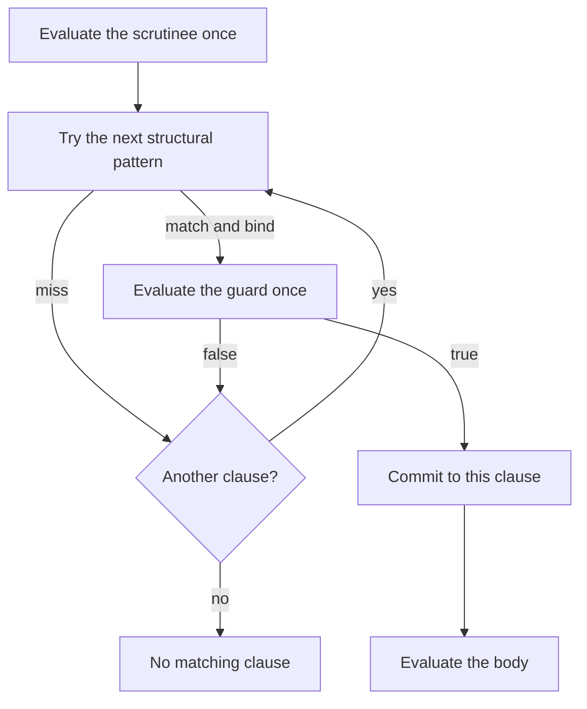
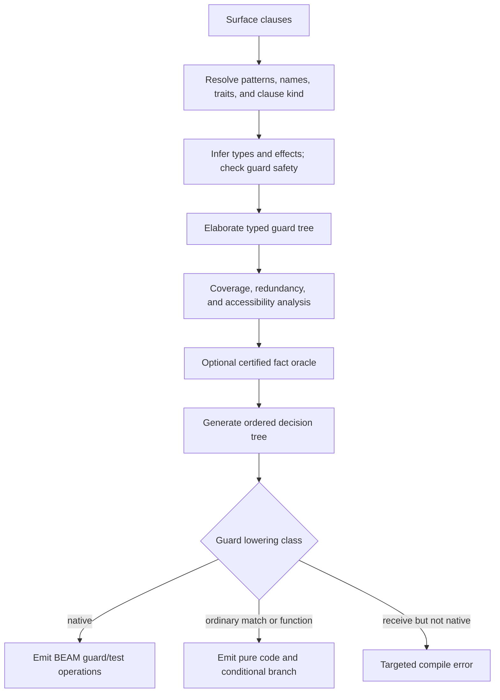

# Clause Guards

## Executive conclusion

A Catena clause guard should be a checked condition between structural pattern
matching and commitment to a clause body:

```text
pattern succeeds -> condition evaluates to true -> run body
                 -> condition evaluates to false -> try the next clause
```

That small description hides the important design decisions. A Boolean result
does not by itself make an expression safe to run during matching. A pure
function may diverge, fail on part of its domain, hide expensive work, or rely
on an instance whose behavior the compiler cannot prove. A guard also changes
coverage: a structurally matching clause may reject the value at runtime.

The recommended initial design is:

1. a guard has type `Bool`;
2. it belongs to a compiler-checked **guard-safe fragment** that is
   effect-free, deterministic, total over its typed inputs, and free of
   user-visible failure;
3. guards run after pattern bindings exist, in source order, with
   left-to-right short-circuit evaluation;
4. `false` continues with the next clause and `true` commits to
   the body;
5. a fault is never silently reclassified as `false`;
6. the initial guard form is Boolean-only and introduces no new bindings;
7. structural coverage remains the sound baseline, while a small
   proof-producing fact oracle may improve precision;
8. a typed guard-tree representation precedes both coverage checking and
   match compilation; and
9. ordinary matches and function clauses may lower non-native guards to normal
   pure branches, while selective-receive guards initially require a stricter
   BEAM-native lowering.

The public guide can call this a **clause condition** and explain “run this
clause only when the condition is true.” The semantic reference can retain
**guard** as the precise compiler term.

This proposal extends the shorter guard recommendation in
[Algebraic Data Types](algebraic-data-types.md) and connects it to the type,
effect, trait, coverage, and BEAM layers described in the
[Catena Language Overview](../language-overview.md).

## Version 0.1.3 decision and implementation result

The normative
[Clause Condition Specification](../60-specification/clause-conditions/README.md)
now turns the recommendation into one deliberately smaller executable
boundary. Version 0.1.3 selects:

- Boolean and integer literals and immutable variables;
- lazy `not`, `and`, and `or`;
- exact `Bool` and `Int` equality and inequality;
- integer order, unary negation, addition, subtraction, and multiplication;
- explicitly signed, monomorphic, first-order, acyclic condition predicates;
- a deterministic internal fact checker for Boolean formulas whose integer
  atoms reduce to difference constraints;
- ordinary matches and multi-clause functions, plus a typed native-only
  receive lowering harness rather than public receive syntax; and
- version 0.1.3 interfaces exposing canonical predicate bodies and digest-bound
  evidence.

Constructor observations, field projections, membership and range operations,
trait methods, partial operations justified by path facts, recursive total
predicates, and external solver integration remain later research. Sections
below that discuss those possibilities are extension analysis, not part of the
version 0.1.3 contract.

The historical Elixir/OTP 29 implementation passed 46 tests spanning reference
evaluation, native and ordinary BEAM lowering, guarded coverage, interface
tampering, and the receive harness. The
[evidence journal](../50-journal/2026-08-02-c003-executable-clause-condition-conformance.md)
records the commands and limitations. Published compiler commit
[`165fc4837f101d01016248e62479ef4caa0f20ce`](https://github.com/pcharbon70/catena/commit/165fc4837f101d01016248e62479ef4caa0f20ce)
provides immutable semantic evidence under retired identifier `0.3`, so C003
is semantically complete. The
[renumbering record](../50-journal/2026-08-04-prototype-slice-renumbering.md)
tracks publication of the fresh `0.1.3` protocol identity.

## Question, scope, and method

### Research question

What is the smallest clause-guard design that is:

- predictable under ordered pattern matching;
- compatible with Catena's explicit effect system;
- sound for exhaustiveness and redundancy analysis;
- implementable efficiently on the BEAM;
- extensible to verified predicates and later pattern guards; and
- explainable without teaching users a runtime whitelist or a theorem prover?

### Operational standard

The design **understands a clause guard** when the specification and compiler
can answer all of these questions for any accepted guard:

- When, and how many times, is it evaluated?
- Which names are in scope?
- Can it perform an effect, diverge, or fail?
- Does `false` continue with the next row, alternative, message, or
  handler?
- What does it contribute to exhaustiveness and redundancy?
- Which facts, if any, become available in the body?
- Can it compile as a native BEAM guard?
- If it cannot, what semantics-preserving fallback is used?

A design is **reliable** when no accepted exhaustive match can fail merely
because the compiler guessed a guard proposition, and when interpretation and
BEAM lowering select the same clause for the same value.

### Scope

The main subject is a condition attached to an ordered clause in:

- a `match` expression;
- a multi-clause function;
- a selective receive; or
- another future clause-based construct.

This is not the imperative-programming idiom that calls an early return an
“opening guard clause.” Pattern guards that evaluate new scrutinees and bind
new variables are compared, but are not recommended for the initial language.
Programmable views, pattern synonyms, and effect-handler clause filters remain
separate extension boundaries.

### Evidence method

The comparison uses:

- the current [Erlang/OTP expression semantics](../30-sources/erlang-otp-expressions-and-guard-sequences.md)
  and [matching optimization guidance](../30-sources/erlang-otp-function-matching-optimization.md)
  for the runtime-nearest design;
- the [OCaml 5.4 expression manual](../30-sources/ocaml-5-4-expressions-and-pattern-guards.md)
  for unrestricted typed Boolean guards;
- the [Haskell 2010 report](../30-sources/marlow-2010-haskell-language-report.md)
  for Boolean, pattern, and binding guards with a kernel translation;
- the [Rust Reference](../30-sources/rust-reference-match-expressions.md)
  for effectful guards, conditional bindings, and ownership-sensitive
  evaluation;
- [Maranget's structural coverage algorithm](../30-sources/maranget-2007-warnings-pattern-matching.md);
- [Lower Your Guards](../30-sources/graf-et-al-2020-lower-your-guards.md)
  for a compositional guard-tree coverage IR; and
- [structural and semantic guard analysis](../30-sources/kalvoda-kerckhove-2019-structural-semantic-pattern-matching.md)
  for the benefits and costs of an SMT-backed precision tier.

Reported source behavior, cross-source inference, and the Catena proposal are
identified separately below.

## Terms that must remain distinct

### Structural pattern

A structural pattern recognizes and decomposes a value through constructors,
literals, tuples, records, or another explicitly specified pattern form. Its
matching behavior is part of the language rather than an arbitrary user
computation.

### Clause guard

A clause guard is a Boolean condition evaluated after its structural pattern
succeeds and before the clause body is selected. Pattern-bound variables are
in scope in the guard.

### Fallthrough

Fallthrough means continuing selection after the current pattern or guard
rejects a value. It is not an exception, effect operation, or recursive call.

### Commitment

A clause commits when its structural pattern and guard have both succeeded.
After commitment, evaluation of the body does not resume matching later
clauses if the body fails.

### Pattern guard

A pattern guard evaluates an expression, matches its result against another
pattern, and may add bindings for later conditions or the body. It is closer to
a nested match than to a Boolean predicate.

### Comprehension filter

A list-comprehension filter is an ordinary expression of type `Bool`, evaluated
for every environment produced by the preceding qualifiers. Unlike a clause
guard, it may perform declared effects and its failures propagate normally;
`false` rejects only the current candidate. The shared Boolean appearance must
not erase this semantic distinction. The complete proposal is in
[List Comprehensions](list-comprehensions.md).

### Guard-safe

Guard-safe is a static operational judgment. It means that an expression is
suitable for clause selection: it is Boolean, effect-free, deterministic,
total over the values admitted by its types and known facts, and cannot signal
a user-visible failure.

Guard-safe is stronger than pure. It is also not a mathematical law such as
associativity.

### Coverage fact

A coverage fact is a proposition the compiler may use to prove a row
unreachable or a match exhaustive. Evaluating a Boolean at runtime and proving
its value for every relevant input are different activities.

## What existing designs establish

| Design | Guard surface | Effects and failure | Bindings | Coverage consequence |
| --- | --- | --- | --- | --- |
| Erlang/OTP | Restricted expressions and guard BIFs | Side effects excluded; invalid guard operations make the guard fail | Existing pattern bindings | Runtime filter; exact BIF set is implementation-facing |
| OCaml 5.4 | Arbitrary Boolean expression | Ordinary expression effects, divergence, and exceptions remain possible | Existing pattern bindings | False resumes later patterns |
| Haskell 2010 | Boolean, pattern, and local-binding guards | Pure but may be strict or divergent through bottom | Pattern and local guards add bindings | Rich source desugars into nested matching |
| Rust Reference | Boolean expressions and conditional `let` chains | Side effects are possible; or-pattern expansion can repeat them | Conditional matches add bindings | Evaluation and ownership rules become part of guard semantics |
| Catena proposal | Checked Boolean guard-safe expression | Empty effect row, total, deterministic, no hidden failure | Existing pattern bindings only at first | Conservative structural baseline plus certified fact reasoning |

The evidence does not identify one universally correct guard language. It
reveals a tradeoff:

- unrestricted expressions maximize local convenience but enlarge the
  operational and coverage contract;
- a fixed whitelist controls behavior but couples the language to a changing
  runtime surface; and
- a checked semantic fragment can be compositional, but requires Catena to
  define and implement a totality judgment.

## Proposed dynamic semantics

### Illustrative surface

The exact keyword is not fixed. The examples use `when` because it reads as
a condition rather than a second branch:

```text
match value with
| Some x when x > 0 -> Positive(x)
| Some x            -> NonPositive(x)
| None              -> Missing
```

An omitted guard is semantically `when true`.

### Selection state machine



For ordinary matches and functions:

1. evaluate the scrutinee or arguments once;
2. attempt clauses in source order;
3. when a pattern misses, continue with the next clause;
4. when a pattern succeeds, bind its variables and evaluate its guard once;
5. when the guard is false, discard those row-local bindings and continue;
6. when the guard is true, commit and evaluate the body; and
7. never return to clause selection because the selected body later fails.

An exhaustive context rejects step 7's “no matching clause” state at compile
time. A runtime no-match trap remains only for explicitly unchecked dynamic
boundaries or a compiler/runtime defect.

### Or-patterns evaluate one guard once

An or-pattern is one structural pattern whose alternatives bind the same names
at the same types. The proposed rule is:

```text
| (Small x | Medium x) when acceptable(x) -> ...
```

The structural matcher tries its alternatives left to right. After one
alternative succeeds, `acceptable(x)` runs exactly once. It is not
re-evaluated for each alternative that could match the same value.

This avoids the multiple-evaluation behavior documented for effectful Rust
or-pattern guards. It also gives the compiler a stable cost model and a simple
source-level explanation.

### Boolean composition

Catena should use its ordinary lazy Boolean operators:

- `a and b` evaluates `a` first and evaluates `b` only
  when `a` is true;
- `a or b` evaluates `a` first and evaluates `b` only
  when `a` is false; and
- parentheses, not a second guard-sequence grammar, express grouping.

Catena should not copy Erlang's comma/semicolon distinction. One Boolean
expression is easier to type, document, and diagnose.

Guard-safety checking should follow those short-circuit paths. In
`n != 0 and limit / n > 2`, the second operand is checked under the
recognized fact that `n` is nonzero. In `a or b`, the second
operand is checked only under facts established by `a` being false.
Unsupported propositions remain unknown, so they cannot justify a partial
operation. This path sensitivity is internal to guard checking; it does not
change the public Hindley–Milner type of a variable.

### Guard failure is not exception handling

Only `false` means ordinary guard rejection. The compiler should reject an
expression that can raise, perform an exception-like effect, or invoke a
partial primitive inside a guard.

Catena should not copy Erlang's rule that an invalid guard operation silently
makes the guard fail. In a statically typed language, silently converting a
programmer mistake into selection of a later clause can hide defects:

```text
| Request n when limit / n > 2 -> ...
| Request _                    -> fallback
```

If `n` may be zero, the division is not guard-safe. The programmer can
match a nonzero representation, add an earlier condition that establishes a
recognized nonzero fact, or use a total checked operation returning
`Option` or `Result` outside the Boolean guard.

Out-of-memory, VM termination, and compiler defects remain outside the
language-level totality guarantee; they do not become false guards.

## The guard-safe static judgment

### Required properties

The compiler needs a judgment conceptually shaped like:

```text
facts; types |-guard expression : Bool
```

Successful checking implies all of the following:

| Property | Requirement |
| --- | --- |
| Result | Exactly `Bool`, not truthiness or an arbitrary term |
| Effects | Empty effect row |
| Determinism | Same immutable inputs produce the same Boolean |
| Domain | Defined for every value admitted by its types and established facts |
| Termination | Cannot recurse or loop without a checked termination argument |
| Failure | Cannot panic, throw, resume, or convert a fault into fallthrough |
| Bindings | Reads existing lexical and pattern bindings; adds none initially |
| Order | Uses specified left-to-right short circuiting |

This judgment should elaborate to ordinary typed core plus evidence that the
expression satisfies the guard restrictions. It is not a second untyped
language embedded in Catena.

### Initial expression set

The initial checked fragment can admit:

- Boolean literals and immutable variables;
- total constructor tests and field observations already justified by a
  successful pattern;
- Boolean negation and short-circuit conjunction/disjunction;
- total equality and ordering operations with guard-safe evidence;
- total arithmetic comparisons and operations whose domain is complete;
- finite literal membership and range tests with specified semantics; and
- calls to compiler-verified guard predicates.

It should reject:

- performing or handling algebraic effects;
- sending, receiving, spawning, reading time, randomness, or mutable state;
- unchecked indexing, division, head/tail, map lookup, decoding, or foreign
  calls;
- recursive or higher-order calls whose termination is not established;
- dynamic dispatch whose selected implementation is not guard-safe;
- resumptions, callbacks, and lazy computations that may escape the guard
  check; and
- user assertions that merely promise totality without checkable evidence.

### Pure is necessary but insufficient

An empty effect row rules out visible requests, but does not prove:

```text
loop_forever : A -> Bool
first_is_zero : List Int -> Bool
divide_test : Int -> Int -> Bool
```

The first can diverge, the second can be undefined for an empty list, and the
third can fail for a zero divisor. Guard safety therefore cannot be defined as
“typechecks as `Bool` with no effects.”

### User-defined guard predicates

A small initial release can support only trusted intrinsics and non-recursive
predicate definitions whose bodies are rechecked in the guard fragment. A
future surface might look like:

```text
guard predicate positive(x: Int) -> Bool =
  x > 0
```

The spelling is provisional. The important rule is that `guard` is not an
unchecked promise. The compiler must:

1. typecheck the body;
2. confirm an empty effect row;
3. establish totality and termination in the accepted fragment;
4. record guard safety in the public signature; and
5. recheck imported evidence rather than trust a source annotation.

Later, a termination checker or small proof certificate can admit structurally
recursive predicates. Failure to establish totality should mean “not usable as
a guard,” not “the compiler proved it partial.”

### Trait methods inside guards

Catena's equality and ordering are ordinary trait operations. Selecting a
`Setoid` or `Ord` implementation by name does not prove that the
method terminates or avoids effects.

A trait method is guard-safe only when the selected evidence establishes the
operational property. Built-in and compiler-derived instances can carry such
evidence. User implementations need their bodies or certificates checked.
Guard safety is therefore:

- not another categorical law;
- not implied by trait coherence;
- not implied by an empty effect row alone; and
- a property of the selected method evidence, not just its method name.

The coverage oracle must also avoid treating arbitrary user equality as
machine integer equality. A lawful equivalence can still identify values
differently from a primitive literal comparison.

### Guard safety does not mean cheap

A total pure computation can traverse a large tree or allocate a large
intermediate value. The language should specify whether a guard is evaluated,
not promise that it is constant time.

The compiler can add cost diagnostics:

- warn when a guard visibly traverses an unbounded collection;
- warn when the same expensive guard is repeated across overlapping rows;
- warn more strongly in selective receive, where the guard may run for many
  mailbox entries; and
- show an estimated source-level evaluation count where it is statically
  obvious.

These are operational diagnostics, not reasons to change a true result to
false.

## Exhaustiveness, redundancy, and accessibility

### Why guards complicate coverage

The structural pattern:

```text
| Some x when x > 0 -> ...
```

does not cover every `Some` value. Determining exactly which values it
covers requires reasoning about `x > 0`. For arbitrary predicates, exact
coverage is undecidable. Even familiar arithmetic can be deceptive: a
positive/zero/negative partition valid for mathematical integers does not
automatically cover floating-point NaN values.

[Lower Your Guards](../30-sources/graf-et-al-2020-lower-your-guards.md)
shows that structural patterns and guards can share a compositional analysis
IR while the fact oracle remains separately extensible. The
[SMT prototype](../30-sources/kalvoda-kerckhove-2019-structural-semantic-pattern-matching.md)
shows that a supported arithmetic theory can improve precision, but must
translate only an explicit source subset.

### Sound baseline

Catena's mandatory baseline should be conservative:

- an unguarded row contributes its structural pattern to coverage;
- a guard proved to be constant true contributes its structural pattern;
- an unknown guard contributes nothing to exhaustiveness;
- a guard proved false makes its body inaccessible;
- a row structurally subsumed by an earlier unguarded row is inaccessible
  before its guard can run; and
- a guarded row followed by an unguarded row with the same pattern is the
  ordinary way to provide a fallback.

Therefore:

```text
match value with
| Some x when positive(x) -> x
| None                    -> 0
```

is non-exhaustive unless the compiler has proof that `positive(x)` is true
for every inhabitant of the matched payload—which would make the guard
suspicious anyway. The missing witness should point to `Some _` and
explain that the condition may reject it.

### Diagnostic categories

The checker should distinguish:

| Category | Meaning |
| --- | --- |
| Structurally unreachable | Earlier patterns accept every value this pattern could see |
| Guard-proved impossible | The pattern can match, but established facts make its guard false |
| Guard-proved unconditional | The guard is true for every value reaching the row |
| Guard unknown | The compiler cannot establish true or false |
| Body inaccessible | No value reaches the selected body after patterns and guards |
| Redundant condition | Removing the condition does not change selection under proved facts |

“Unknown” is not a warning by itself. It means the guard works at runtime but
cannot close a static coverage gap.

### Optional fact oracle

A later precision tier may reason about:

- Boolean constants and connectives;
- constructor identities already established by patterns;
- equality with finite literals;
- finite ranges;
- selected linear integer comparisons; and
- explicit propositions carried by verified values.

The oracle must be:

- sound for every proposition used to suppress an exhaustiveness error;
- deterministic under a declared resource budget;
- conservative on timeout or unsupported syntax;
- versioned as part of compiler behavior; and
- proof-producing or followed by a small trusted rechecker when an external
  solver is involved.

Solver uncertainty must not make build acceptance nondeterministic. A timeout
returns “unknown,” which requires the same fallback row as the structural
baseline.

The richer oracle is a compiler precision feature, not an expansion of runtime
guard semantics.

### Prefer patterns for finite structural facts

When a finite property has a structural form, patterns are clearer and easier
to prove:

```text
match flag with
| true  -> enabled
| false -> disabled
```

is preferable to two variable patterns guarded by equality with Boolean
literals. Guards should express relationships and domain predicates that are
not naturally structural, not replace ordinary constructors and literals.

## Type refinement in the body

### Initial rule: values keep their inferred types

The initial guard should not introduce general occurrence typing or refinement
types into Catena's Hindley–Milner core. After:

```text
| x when x != 0 -> ...
```

the body may receive an internal nonzero fact for diagnostics or local
optimization, but `x` still has its ordinary inferred type. Public type
inference must not depend on an unstable solver heuristic.

Structural pattern matching already provides the reliable form of refinement:
matching `Some x` makes the constructor and payload facts explicit.
Later GADTs may add scoped type equalities under their own
annotation-directed rules.

### Proof-carrying refinements are a later layer

If Catena later introduces refined values such as `NonZero Int`, a verified
guard might construct or expose evidence for the body. That design must specify:

- the proposition language;
- who checks the proof;
- whether evidence is erased;
- how a false branch negates the proposition;
- interaction with traits and abstract modules; and
- whether inference remains principal.

Until then, programmers should use explicit ADTs or validated constructors when
a fact must persist beyond clause selection.

## Boolean guards versus pattern guards

Haskell and current Rust demonstrate that a guard sequence can evaluate a new
scrutinee, perform a refutable match, and introduce bindings:

```text
| Request text
    when Some first <- first_character(text)
    when is_letter(first)
  -> ...
```

This can be concise, but it adds:

- new scoping and shadowing rules;
- evaluation and binding steps inside the guard list;
- new interactions with or-patterns;
- another route to programmable views;
- harder coverage and witness generation; and
- a larger match-compilation contract.

Catena should initially use Boolean clause conditions only. A nested match or a
total combinator makes the extra refutable step explicit:

```text
| Request text ->
    match first_character(text) with
    | Some first when is_letter(first) -> ...
    | _                                -> ...
```

If real programs show repeated nesting or duplicated fallbacks, pattern guards
can be reconsidered. [Lower Your Guards](../30-sources/graf-et-al-2020-lower-your-guards.md)
provides a plausible elaboration strategy, but does not answer Catena's
usability, totality, or effect questions.

## Which clause forms may use guards?

| Clause form | Initial policy | Reason |
| --- | --- | --- |
| Ordinary `match` | Allow guard-safe Boolean conditions | Clear fallthrough and exhaustive structural fallback |
| Multi-clause function | Allow the same conditions | Functions and matches share selection semantics |
| Selective receive | Allow only mailbox-safe, native-lowerable guards initially | False must leave the message in place and continue scanning |
| Exception/catch clause | Defer until Catena's exception/effect boundary is fixed | Guard failure and exception propagation can be confused |
| Algebraic-effect handler clause | Disallow initially | False could mean next local clause, forwarding, or searching another handler |
| Specification pattern | Reuse only inside the stricter total specification context | Governance decisions require deterministic checking |

### Selective receive is not an ordinary match

The [Erlang expression reference](../30-sources/erlang-otp-expressions-and-guard-sequences.md)
shows that a message is removed only after both pattern and guard succeed. A
false guard leaves the message in place and scanning continues.

For an ordinary match, Catena can compile a non-native but guard-safe predicate
as normal BEAM code between a pattern test and a branch. That fallback is not
obviously available for selective receive: consuming a message, evaluating
ordinary code, and re-enqueuing it would change mailbox order and concurrency
semantics.

The initial receive rule should therefore require a **mailbox-safe** subset:

- every operation lowers directly to the target BEAM's guard/test machinery;
- a verified helper is allowed only when fully inlined into that subset;
- the compiler diagnoses the first non-lowerable operation; and
- source code can move richer processing into the body after a broader
  structural receive when appropriate.

The portable Catena subset should be stable even if a particular OTP release
adds more guard BIFs. Backend-specific acceptance would make source portability
depend on the deployment VM.

### Effect-handler guards require a separate decision

An algebraic-effect operation is normally dispatched by nominal signature and
lexical capability. If a handler clause's guard is false, at least three
meanings are possible:

1. try another clause inside the same handler;
2. forward the operation to an outer handler; or
3. reject the program as unhandled.

Those meanings affect abstraction safety and effect rows. Catena should not
reuse ordinary match fallthrough until the handler calculus states which one is
intended.

## Compiler architecture

### Typed guard-tree IR

The compiler should elaborate surface clauses into a small typed tree before
coverage and code generation:

```text
Choice(
  Sequence(
    PatternTest(pattern),
    GuardTest(boolean_expression),
    Commit(body)
  ),
  next_clause
)
```

The real IR may split structural tests and bindings more finely. It must
preserve:

- source locations for each pattern, guard, and body;
- binding scopes and types;
- the exact point of commitment;
- source-order fallthrough;
- guard-safety evidence;
- known propositions for coverage;
- divergence information where the wider language admits it; and
- backend lowerability information only as a later annotation.

### Pipeline



Coverage consumes the typed guard tree, not raw syntax and not backend
instructions. The same representation can feed the reference interpreter and
the optimizer.

### Native and semantic guards are different sets

A **semantic guard** is accepted by Catena's guard-safety rules. A
**native-lowerable guard** can be expressed directly using the target BEAM's
guard and test facilities.

For ordinary matches:

- native-lowerable guards use efficient BEAM tests;
- other guard-safe expressions compile to ordinary pure code followed by a
  conditional branch; and
- both paths must satisfy the same source semantics.

For selective receive, the initial language accepts only the intersection with
the portable native-lowerable subset.

This separation prevents the Erlang BIF list from becoming Catena's language
definition while still taking advantage of the runtime.

### Optimization constraints

The match compiler may:

- share identical structural tests;
- turn constructor choices into jump tables or selection instructions;
- inline verified predicates;
- eliminate guards proved true;
- eliminate bodies whose guards are proved false; and
- cache a pure guard result when that preserves source evaluation count.

It may not:

- move a guard across an overlapping earlier clause;
- evaluate a guard before its pattern bindings exist;
- duplicate a guard contrary to the one-evaluation rule;
- turn a guard fault into false;
- use unproved trait laws to change a condition; or
- change selective-receive mailbox order.

The [Erlang efficiency guide](../30-sources/erlang-otp-function-matching-optimization.md)
provides concrete evidence that overlapping guarded clauses constrain otherwise
profitable selection strategies.

## Relationship with effects, specifications, and erasure

### Effects

Clause selection has an empty effect row. A guard cannot perform an operation
and then pretend that operation was merely a test. This keeps:

- clause order from becoming observable through I/O;
- compiler sharing from duplicating requests;
- handler selection from depending on hidden operations; and
- receive scanning from performing an unbounded number of user-visible
  actions.

If Catena models panic, cancellation, or partial primitives outside the effect
row, the guard-safe checker must still reject them. The empty row is one input
to guard safety, not its whole definition.

### Specifications

A specification may prove that a guard is always true or false under stated
preconditions. That proof can improve coverage only when:

- it refers to the exact guard expression and semantic digest;
- its assumptions are accepted by the active verification profile;
- the proof or certificate is checked by the trusted core; and
- the manifest records any assumption used.

A test run, bounded model, approval, or attestation does not prove universal
guard coverage by itself.

### Erasure

Guards are runtime program material unless proved removable by an ordinary
semantics-preserving optimization. They are not erased merely because their
source declaration resembles a specification.

Proof terms and solver certificates supporting a simplification can be erased
from `.beam` code after checking, while the signed sidecar manifest
records the assurance claim. A required runtime guard remains in the executable
artifact.

## Diagnostics and approachable vocabulary

### Use “condition” in task-facing messages

Diagnostics should lead with the programmer's task:

```text
This clause condition can reject Some values.
Add an unguarded Some fallback or cover the remaining values explicitly.
```

The detailed explanation may then say that guarded rows do not establish
structural exhaustiveness.

### Required diagnostic cases

The compiler should distinguish at least:

- **wrong result type** — “This clause condition returns `Int`; it
  must return `Bool`.”
- **effectful condition** — “Reading time can change clause selection. Compute
  it before the match and match the resulting value.”
- **partial operation** — “This lookup can fail for a key not established by
  the pattern.”
- **unproved termination** — “This recursive predicate is pure, but the
  compiler cannot establish that it finishes.”
- **non-exhaustive guarded row** — “`Some _` can reach this row and
  fail its condition; no later row accepts it.”
- **structural shadowing** — “An earlier unguarded pattern accepts every value
  this clause could receive, so its condition never runs.”
- **contradictory condition** — “Under the pattern's facts, this condition is
  always false.”
- **receive lowerability** — “This condition is guard-safe but cannot run while
  scanning a BEAM mailbox.”
- **receive cost** — “This traversal may run once for every skipped message.”

Messages should show the responsible source expression and the relevant
earlier or missing clause. They should not expose solver internals unless an
expanded diagnostic is requested.

## Alternatives considered

### Allow any Boolean expression

**Benefit:** minimal new static machinery and maximum local flexibility.

**Cost:** effects, hidden failure, divergence, repeated evaluation, and receive
behavior become part of clause selection. Coverage remains broadly opaque.

**Decision:** reject for the initial language.

### Require only an empty effect row

**Benefit:** integrates directly with the proposed effect system.

**Cost:** pure partial and nonterminating functions still exist. A match could
hang or fail during selection while appearing “safe.”

**Decision:** necessary but insufficient.

### Copy Erlang's guard BIF whitelist

**Benefit:** straightforward native lowering, including selective receive.

**Cost:** source semantics become coupled to runtime releases; user-defined
predicates compose poorly; exception-to-false behavior hides typed mistakes.

**Decision:** use a stable native-lowerable subset for receive backends, not as
the full Catena guard language.

### Treat all guard faults as false

**Benefit:** matches Erlang and makes partial tests convenient.

**Cost:** misspelled fields, invalid arithmetic, or broken trait methods can
silently select a later clause.

**Decision:** reject. Only a Boolean false means rejection.

### Propagate ordinary guard exceptions

**Benefit:** preserves ordinary expression behavior.

**Cost:** makes clause selection partial and turns an apparently exhaustive
match into an exception source.

**Decision:** reject the partial expression statically instead.

### Add pattern guards immediately

**Benefit:** avoids some nested matches and supports local refutable bindings.

**Cost:** expands scope, coverage, evaluation, and programmable-pattern
semantics before real Catena programs demonstrate the need.

**Decision:** stage after Boolean guards and gather corpus evidence.

### Trust an SMT solver for exhaustiveness

**Benefit:** recognizes useful arithmetic partitions.

**Cost:** unsupported terms, timeouts, solver bugs, version drift, and
unexplained diagnostics can change build acceptance.

**Decision:** permit an optional certified oracle; unknown remains
conservative.

## Formal and implementation obligations

### Static properties

A guard calculus needs proofs or executable metatheory for:

- type preservation of guard elaboration;
- effect exclusion;
- guard progress for all typed, guard-safe inputs;
- termination or a clearly bounded accepted fragment;
- scoping of pattern bindings;
- no bindings escaping a false guard;
- coherence of guard-safe trait evidence; and
- principality of the surrounding HM inference.

### Dynamic properties

The reference semantics and backend need differential tests for:

- scrutinee evaluation exactly once;
- guard evaluation exactly once after pattern success;
- left-to-right Boolean short circuiting;
- false falling through to precisely the next clause;
- body failure not reopening selection;
- or-pattern behavior;
- match/function equivalence;
- selective-receive mailbox preservation; and
- native versus ordinary-branch result equivalence.

### Coverage properties

The coverage checker must establish:

- every match accepted as exhaustive reaches a body for every typed input;
- every body reported inaccessible has no satisfying input under trusted facts;
- unknown solver results never suppress a required fallback;
- witnesses respect constructor visibility, empty types, and open rows; and
- resource limits prevent adversarial guard trees from exhausting the
  compiler.

### Operational measurements

Prototype measurement should compare:

- native BEAM guard lowering with ordinary conditional lowering;
- repeated overlapping clauses with shared guard-tree tests;
- inlined versus called verified predicates;
- selective receive across mailbox sizes and rejection rates;
- compile-time cost with and without the fact oracle; and
- diagnostic latency on adversarial pattern matrices.

No performance claim should be promoted from microbenchmarks alone. The
prototype corpus must include ordinary validation, routing, protocol, and
message-selection code.

## Staged implementation recommendation

The C003 implementation covers the closed portions of stages 1 through 3 and
the internal difference-constraint portion of stage 4. Its published
historical evidence used retired protocol identifier `0.3`; the
[renumbering record](../50-journal/2026-08-04-prototype-slice-renumbering.md)
tracks the fresh `0.1.3` identity. The remaining items below are the route for
widening or validating that boundary, not claims that the current prototype
contains every stage.

### Stage 1: semantic kernel

1. Define strict ordered clause selection in a small calculus.
2. Add Boolean guards over literals, bindings, total primitives, and lazy
   Boolean operators.
3. Define the guard-safe judgment and reject arbitrary calls.
4. Elaborate matches and multi-clause functions into a typed guard tree.
5. Implement structural coverage with guard-aware fallthrough.
6. Build an interpreter used as the backend oracle.

### Stage 2: BEAM lowering

1. Classify guard-tree operations by native lowerability.
2. Emit native guard tests where possible.
3. Emit ordinary pure conditional code for non-native guards in matches and
   functions.
4. Restrict selective receive to the portable native subset.
5. Differentially test both lowering paths against the interpreter.

### Stage 3: verified predicates

1. Permit non-recursive user predicates checked wholly in the guard fragment.
2. Record guard safety in module signatures and trait evidence.
3. Add a termination-checked recursive fragment only after its proof and
   diagnostics are usable.
4. Add cost lints without changing semantics.

### Stage 4: precision and extensions

1. Add a small fact oracle for finite and linear integer facts.
2. Require proof certificates or trusted rechecking for acceptance-changing
   conclusions.
3. Evaluate pattern guards against real nesting and duplication evidence.
4. Revisit handler-clause guards only with the effect calculus.
5. Widen receive guards only with a mailbox-preserving runtime strategy.

## Falsification criteria

The recommendation should be revised if:

- common validation predicates cannot be expressed without moving most logic
  outside the match;
- guard-safety checking produces frequent, unactionable termination errors;
- the native/ordinary split causes materially different behavior or
  unacceptable overhead;
- a stable portable receive subset is too weak for representative actor
  protocols;
- users consistently misunderstand why a guarded row is not exhaustive;
- certified solver results cannot remain deterministic and explainable;
- trait-based equality or ordering makes guard safety impractical; or
- Boolean-only guards create pervasive nested matches that pattern guards
  would remove without compromising the other guarantees.

These are empirical and formal tests, not reasons to weaken the design in
advance.

## Open questions and research priorities

The connected
[inquiry](../40-inquiries/how-should-catena-design-clause-guards.md)
tracks the unresolved choices. The highest-priority questions are:

1. Does the selected `Bool`/`Int` fragment cover representative validation and
   routing programs without excessive precomputation?
2. Does Catena later need a general termination checker or only verified predicate
   forms?
3. Which trait methods can carry guard-safe evidence without complicating
   inference?
4. How should the implemented native subset connect to public receive syntax,
   timeout, effect, protocol, and mailbox-cost rules?
5. What proof and property evidence is still needed beyond the implemented
   typed-core rechecking and differential tests?
6. Does the difference-constraint theory improve real diagnostics enough to
   justify its compile-time cost?
7. Do real programs justify pattern guards or handler-clause conditions?
8. How should guard facts interact with later refinements, GADTs, and erased
   proof evidence?

## Annotated source route

- [Erlang/OTP Expressions and Guard Sequences](../30-sources/erlang-otp-expressions-and-guard-sequences.md)
  supplies the runtime-nearest safety, failure, clause, and selective-receive
  semantics.
- [Erlang/OTP Function Matching and Optimization](../30-sources/erlang-otp-function-matching-optimization.md)
  shows how guarded overlap constrains match compilation.
- [OCaml 5.4 Expressions and Pattern-Matching Guards](../30-sources/ocaml-5-4-expressions-and-pattern-guards.md)
  supplies the minimal arbitrary-Boolean comparison.
- [Haskell 2010 Language Report](../30-sources/marlow-2010-haskell-language-report.md)
  supplies rich guard syntax and a kernel translation.
- [The Rust Reference: Match Expressions](../30-sources/rust-reference-match-expressions.md)
  exposes multiple evaluation, conditional binding, and side-effect concerns.
- [Warnings for Pattern Matching](../30-sources/maranget-2007-warnings-pattern-matching.md)
  supplies the structural usefulness baseline and its explicit guard limit.
- [Lower Your Guards](../30-sources/graf-et-al-2020-lower-your-guards.md)
  supplies the compositional guard-tree and refinement analysis.
- [Structural and Semantic Pattern Matching Analysis in Haskell](../30-sources/kalvoda-kerckhove-2019-structural-semantic-pattern-matching.md)
  supplies evidence for a bounded SMT precision tier.

Follow the curated [Clause Guards map](../10-maps/clause-guards.md) for the
shortest route through the topic.
