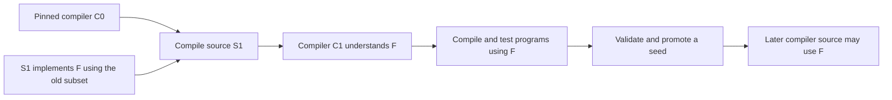

# Feature Evolution in a Self-Hosted Catena Compiler

**Planning adoption:** following this study, the user requested an update to
the current plan. The [Self-Hosted Compiler Evolution Plan](self-hosted-compiler-evolution-plan.md)
now selects the recommended direction and tracks its delivery. The research
argument below remains distinct from that planning adoption; normative
applicability and implementation evidence are still pending.

## Recommendation and answer

**A self-hosted Catena compiler should remain practical to extend.** The routine
workflow is to implement a new feature using language facilities the existing
compiler understands, build that implementation with the existing compiler,
and test the new feature with the resulting compiler. Only afterward should
the compiler's own source start using the feature. Self-hosting adds a build
dependency and evidence obligations; it does not create a requirement to
express every new feature in itself.

For Catena, the recommended long-term arrangement is **a recent, exactly pinned
Catena compiler for ordinary builds, a deliberately conservative subset for
compiler source, and a retained reconstruction chain back to the original
Elixir bootstrap**. Promote the routine seed when a tested feature or compiler
fix becomes necessary for self-compilation. Preserve the intermediate source,
artifacts, libraries, build tools, and host requirements that connect the old
seed to the new one. This is a research recommendation, not an adopted change
to the current specification.

The largest costs will generally come from what a feature changes: inference,
effect safety, representation, runtime behavior, or compatibility. Those costs
exist in an Elixir implementation too. Bootstrap-specific complexity grows
when compiler source starts depending on the feature immediately, when runtime
or artifact formats change, or when the supported bootstrap environment moves.
Keeping two complete production compilers current would add a different cost:
implementing and maintaining features twice.

One local policy issue needs attention before this recommendation can become
the development process. [G141 at revision
0.1.98](../60-specification/compiler-self-hosting/staged-bootstrap-and-fixed-point-evidence.md)
defines the initial Elixir-to-Catena transition, including exact stages and
complete suites under both implementations. It does not yet distinguish that
initial transition from routine evolution after Catena compiler source exceeds
the frozen Elixir compiler's supported language. Retaining a recovery root and
requiring that root to compile every future source revision directly are
different policies.

## Scope, method, and strength of evidence

This study asks how a self-hosted compiler can acquire new language features,
how it can then use them internally, and how contributors and release builders
can reproduce the transition. It covers source compatibility, compiler passes,
libraries, runtime interfaces, bootstrap seeds, testing, recovery, and trust.
It does not choose Catena keywords, grammar spellings, a new target VM, or a
self-hosting implementation date.

The evidence combines eleven primary works: peer-reviewed compiler and
verification papers, a dissertation, official build documentation, and firsthand
engineering articles. Rust, Go, OCaml, GCC, and Zig provide concrete maintenance
mechanisms; the research papers explain compiler architecture and the limits of
bootstrap evidence. Living documentation was read on 14 September 2026.
Historical articles describe their stated versions and dates, not an assumed
unchanged present. Reading locations and limitations are in the
[source notes](#sources).

**Evidence boundary:** the build mechanisms below are documented practice.
The difficulty ratings, proposed Catena workflow, and policy recommendations
are synthesis. The sources do not supply a controlled estimate of Catena
developer-hours, and Catena has no completed self-hosted compiler from which
to measure its bootstrap overhead. No numerical productivity multiplier or
delivery estimate is justified.

A read-only audit of the current research and compiler repositories checked
the local starting point. G141's executable support validates a deliberately
blocked preflight; it is not a completed stage builder. The
[session journal](../50-journal/2026-09-14-self-hosted-feature-evolution-research.md)
records exact commits, inspected files, and the distinction between reading
tests and running them.

## The dependency that makes the apparent circle disappear

Six identities matter when saying that a compiler “supports” a version:

| Identity | What it means | Example of a mismatch |
| --- | --- | --- |
| Accepted program language | Syntax and semantics the resulting compiler can process | A new expression is accepted by the new compiler |
| Compiler implementation language | Facilities used in the compiler's own source | Its parser implementation still uses older ADTs and functions |
| Seed compiler | Existing executable that builds that source | The seed has never seen the new expression |
| Compiler execution dependencies | Libraries and host services needed to build or run the compiler | The compiler's filesystem adapter requires a particular host API |
| Produced-program dependencies | Runtime and libraries required by generated programs | A newly lowered operation calls a newly added runtime primitive |
| Build and artifact contracts | Build driver, generated inputs, interfaces, caches, and metadata | An old tool cannot read a newly versioned interface |

A parser can recognize a new construct by manipulating strings and trees that
already exist. A checker can implement a new rule with existing data
structures. A backend can emit a call to a new runtime operation without the
compiler's source itself making that call. Whether these implementations are
convenient is a language-design question; whether they are expressible in the
seed's subset is the bootstrap question.

Thompson's classic paper provides a particularly clear example. Its Stage II
first implements a new escape using a numeric representation the old compiler
already knows; after rebuilding, the compiler source can use the new escape.
The feature precedes its own use in the implementation.[^1]

For a hypothetical Catena convenience construct, the analogous sequence is:

1. Specify its meaning using already admitted core operations.
2. Extend parsing, checking, diagnostics, and lowering using existing Catena
   constructs.
3. Build that compiler with the current seed.
4. Feed separate example programs containing the new construct to the result.
5. After validation and seed promotion, optionally rewrite compiler code to use
   the construct.

This example does not propose any public spelling. The new test programs are
**inputs to the newly built compiler**. They cannot accidentally become source
files that the old compiler must parse while building the test harness.
Examples, generated code, build scripts, and standard-library sources all need
the same dependency check.

For a compiler algorithm that can be expressed using the existing subset,
there is no inherent logical circle. The circle appears when the source needed
to teach the feature already requires that feature and no compatible bridge
implementation is retained.

## How difficult are different changes?

The following ratings estimate **additional bootstrap coordination**, not the
total difficulty of designing or implementing a feature. “Low” still includes
tests and reproducible builds. “High” means several separately versioned parts
must move together.

| Feature class | Ordinary implementation difficulty | Additional bootstrap coordination | What raises the cost |
| --- | --- | --- | --- |
| Library helper built from existing operations | Usually localized | Low | Compiler source calls it before the seed's build dependencies provide it |
| Surface convenience lowered to the existing core | Localized to moderate | Low with delayed self-adoption | Parser ambiguity, changed diagnostics, or eager self-use |
| New optimization over an unchanged IR | Depends on its correctness argument | Low to moderate | It miscompiles the compiler, changes comparison artifacts, or requires new certificates |
| New type-inference or evidence-selection rule | Potentially substantial | Moderate | Compiler source immediately relies on new inference or interface metadata |
| New effect operation using an existing handler mechanism | Depends on capability and adapter contracts | Low to moderate | Runtime adapters, authority accounting, or effect metadata change |
| Changed handler, resumption, or resource semantics | Substantial and cross-cutting | High | Checker, verifier, lowering, cleanup, and runtime must transition together |
| New compiled interface or package schema | Moderate to substantial | High | Old tools silently read or reuse incompatible artifacts |
| Runtime primitive or value-representation change | Substantial | High | Compiler runtime and generated-program runtime differ during the transition |
| Removal of a construct used by the compiler | Potentially modest implementation work | Moderate to high | Uses must be migrated while a compatible builder still exists |
| New supported host or OTP contract | Potentially substantial | High | Seeds, dependencies, loading rules, and recovery hosts all need evidence |

For Catena, category theory does not by itself make bootstrap transitions more
difficult. It does make some proposed additions carry explicit laws,
coherence, and evidence requirements. A library combinator derivable from
existing operations is very different from changing how evidence is selected.
Similarly, adding a service operation within the existing effect mechanism is
different from admitting another resumption discipline.

The [excluded-feature
contract](../60-specification/excluded-advanced-type-features/README.md) still
governs a compiler written in Catena. Self-hosting is not a reason to admit an
otherwise excluded type form. A feature that requires changing the language's
safety argument should first be assessed as a semantic extension, then as a
bootstrap transition. The compiler being its first large customer does not
relax either assessment.

## Workflows for teaching and adopting features

### Workflow 1: implement with the existing subset, then adopt later

This should be the default for additive features.

Let `C0` be the pinned working compiler. Let `S1` be new compiler source
that implements feature `F` but uses only facilities understood by `C0`.



The contributor normally needs one build to obtain a compiler that can exercise
the feature. Subsequent full self-builds and release checks have a separate
purpose. The implementation does not wait for the compiler's internal rewrite
to prove useful.

The main discipline is an explicit compiler-source floor: which syntax,
semantics, libraries, and compile-time behavior the seed must support. A public
language feature can be available to users before the compiler source is
allowed to depend on it. These are separate lifecycle decisions.

This arrangement gives reviewers a smaller question: does this change implement
the proposed behavior correctly? A later self-adoption change answers another:
can the compiler now rely on that behavior, and does doing so improve its code?
Combining them can obscure which half caused a bootstrap failure.

### Workflow 2: retain an explicit bridge for immediate self-adoption

Sometimes a feature materially simplifies the compiler itself, or a seed bug
prevents building the desired new source. A bridge can make progress without
waiting for a normal seed release.

Keep source `A`, which is compatible with the old seed and implements the
required feature or fix. Build `A` with `C0` to obtain `CA`. Then use
`CA` to compile source `B`, which adopts the new facility. The result,
`CB1`, rebuilds the exact same `B` to obtain `CB2`; another build may be
needed for the selected comparison.

**A and B are different source inputs.** Comparing their executables as if
they were same-source fixed-point stages is invalid. The bridge transition
and the subsequent comparison need separate records.

A bridge may be a small compatible patch, an intermediate release, or a
retained source revision. It needs an immutable identity and a reproducible
recipe. If recovery depends on a Git commit containing `A`, that commit must
remain reachable through a retained tag, source bundle, or equivalent immutable
archive. Squashing away the only usable intermediate source would break the
reconstruction chain even if the final repository contains working source.

A short-lived local binary is enough for an experiment, but not for a released
toolchain's recovery story. Acceptance includes rebuilding the bridge without
that binary already installed.

### Workflow 3: advance a published seed floor

Use a known earlier Catena release or accepted seed artifact for routine
development, and advance that floor deliberately. Go demonstrates that a
self-hosted project can publish an advancing minimum bootstrap version rather
than keep the first language implementation sufficient forever.[^4]

For example, its published table says Go 1.24 and 1.25 require Go 1.22 or later
as the bootstrap. This illustrates a documented floor; those numbers are not
a claim about the latest Go release.[^4]

For Catena, the exact seed digest should accompany the compatibility floor.
A declaration such as “supports the required source facilities” explains the
requirement, while the digest identifies the artifact actually used in
evidence. A version comparison alone cannot establish support for a private
preview or a necessary bug fix.

Seed promotion should identify the feature or fix that makes it necessary,
prove that the previous retained seed can build the new seed through declared
sources, and record matching libraries and host dependencies. Unnecessary
promotions increase rebuild-chain and contributor costs; excessively delayed
promotions force compiler code to avoid useful facilities.

This study does not recommend a calendar interval or a fixed number of releases
of lag. Catena lacks the build-time and contributor data to choose that
responsibly. Begin with need-driven promotions and measure their frequency.

### Workflow 4: use limited compatibility branches or generated source

A source tree can sometimes support both old and new builders through narrowly
scoped alternatives. Rust's bootstrap documentation illustrates stage-specific
configuration, while also making clear that enabling unstable behavior only
helps when the builder already implements it.[^2]

A flag cannot teach an old parser new syntax. Depending on the language,
conditional code may still be parsed or checked before it is discarded.
A viable bridge must either use old-parseable constructs or select compatible
source files through an already supported build mechanism before the old
parser sees them.

A downlevel translator is another possibility: maintain pleasant newer source
and generate an older subset for bootstrap. That translator then becomes a
compiler component needing semantic preservation, reproducibility, diagnostics
provenance, and a way to build itself. It can be worthwhile for a small,
well-defined lowering; it is a poor default when it grows into a second
language implementation.

Catena's current [reproducible-build
contract](../60-specification/reproducible-builds/exact-inputs-and-canonical-packages.md)
has a closed generator model. It does not already authorize an arbitrary source
transpiler or shell preprocessing step. Any such bootstrap mechanism would need
an explicit future contract and retained inputs. This workflow is an option
for evaluation, not an available escape hatch.

### Workflow 5: transition runtime and library interfaces in stages

Runtime changes require tracking what executes the compiler separately from
what its output executes. A new compiler may initially run with the seed's
matching libraries while compiling a different library revision for new
programs. Rust's 2025 redesign of its initial build sequence is a direct
engineering example of separating those roles.[^3]

For a Catena runtime operation, the proposed transition is:

1. Add the new implementation while retaining the old interface where coexistence
   is safe and explicitly specified.
2. Teach the compiler to generate the new form without yet requiring it in
   seed-built source.
3. Build and test the matching runtime/library and compiler artifacts together.
4. Migrate the compiler's own calls after a compatible seed is available.
5. Retire the old interface only after supported bootstrap and recovery edges
   no longer require it.

OCaml's bootstrap instructions document this kind of sequencing for primitives:
renaming temporarily retains an old-name stub, and removal first eliminates
uses. Its compiled-format changes also require explicit bootstrap handling.[^5]

Not every interface can coexist safely. If value representation or authority
semantics make mixed versions invalid, use isolated, matched build worlds and
refuse cross-loading. Catena's [API/ABI
matrix](../60-specification/api-and-abi-compatibility/breaking-change-matrix.md)
and [OTP artifact
contract](../60-specification/otp-compatibility/support-probes-and-artifacts.md)
already favor explicit compatibility and identity checks. A convenient adapter
cannot silently redefine those rules.

Removing or changing source behavior needs a related bridge. First build a
compiler that supports the old and replacement forms under their explicit
language selections. Use it to migrate compiler source, then promote a seed
that can build the migrated source. Only afterward can the compiler's own
implementation stop depending on the old form. Whether users may lose that
form is a separate language-compatibility decision; retained selections cannot
silently acquire the new meaning. If the two meanings cannot coexist in one
selection, the bridge needs an explicit selection boundary or separate sources.

### Workflow 6: distribute a seed artifact while retaining reconstruction

An archived executable, bytecode image, or lowered source bundle can make a
routine bootstrap much easier to obtain. The artifact contains support for the
features needed by current compiler source, avoiding a fresh build of the full
historical chain on every checkout.

Zig's 2022 transition replaced its second C++ implementation with a retained
WebAssembly seed and a C-based reconstruction route. The account explicitly
recognizes the tradeoff between simpler ongoing maintenance and fixed-step,
source-only bootstrapping.[^6]

For Catena, this suggests distributing a verified, digest-bound BEAM seed and
its exact dependency envelope. It does **not** suggest adopting Zig's output
targets, adding WebAssembly, or changing G141's BEAM-only target. Nor does
“BEAM artifact” by itself mean portable across all hosts or OTP versions.
The current Catena profile records and checks a more specific toolchain and
host identity.

A snapshot and a recovery chain solve different problems. The snapshot makes
ordinary builds convenient; the chain lets a builder reconstruct how the
snapshot arose. Keeping only a snapshot would weaken the research archive's
current recovery objective. Keeping only the chain could make routine
contribution needlessly slow.

Producing a seed on another host can help when the destination has no usable
compiler. It does not teach an unsupported feature: the compiler performing
that build still needs to understand its input. For Catena, any such route
would also need evidence for the destination's declared OTP and host profile.

### Workflow 7: retain a small compiler subset or an independent implementation

The compiler can deliberately remain in a stable subset for a long time.
New features are implemented as transformations or semantic algorithms within
that subset. This minimizes seed promotions and keeps a frozen bootstrap
useful. Its cost is that the language's most substantial program cannot
regularly exercise newer features in its own implementation.

An interpreter for that subset could supply another bootstrap route, provided
it can execute the real compiler source with all necessary services. An
interpreter of retained semantic descriptors is not automatically an interpreter
of future public Catena programs. Adapting one would be additional work with
its own completeness and performance requirements.

Alternatively, keep the Elixir compiler current as a second complete
implementation. That supports broad differential testing and direct
reconstruction from familiar tools, but introduces ongoing duplication.
Independent reference models can preserve valuable checks without recreating
every production parser, optimizer, packaging tool, and language service.

These choices are not free substitutes. A frozen subset trades language
dogfooding for stability; a maintained second implementation trades developer
effort for another execution path. The recommendation is a conservative,
advancing subset plus targeted independent evidence.

### Workflow 8: use a verified bootstrap construction

Mechanized bootstrap proofs can establish more than ordinary self-builds.
CakeML combines a theorem about its source implementation with verified
compilation; its account also describes additional translation work when
supported operations change.[^9] Myreen's smaller proof pearl separates the
compiler correctness result from the fact of self-application.[^10]

This is a possible long-term assurance path for Catena, not a prerequisite
for adding the next feature. It would require a suitable formal compiler
semantics, translation relation, proof-maintenance plan, and treatment of
host services. Existing bounded kernel proofs cannot be relabeled as a proof
of a future full compiler.

A verified route changes the evidence work, not the basic dependency rule.
New source still needs a builder or verified translator capable of processing
it. Features affecting intermediate languages and semantics may require proof
updates as well as ordinary implementation changes.

## Architecture that keeps changes local

The proposed Catena design separates public syntax, checked semantic forms,
lowering passes, and the OTP boundary. A convenience feature can then disappear
during an early translation, while later passes see existing forms. A semantic
extension may instead require an explicit new node, invariant, or operation;
forcing it into an inadequate old representation can conceal obligations.

The Nanopass work provides evidence that explicit intermediate languages and
small passes can support a substantial production compiler. Its evaluation
also reports slower compilation alongside improvements in generated code, so
pass decomposition should not be treated as costless or as a measured
feature-productivity guarantee.[^8]

For Catena, the practical research recommendation is to give each pass a
declared input language, output language, invariants, and observation tests.
When a feature is proposed, identify the first representation that expresses
its meaning and the last representation that needs to know about it. Review
that affected interval rather than assuming the whole compiler must change.

The effect system needs particular care. A surface convenience around an
existing scoped operation may lower early. A change to cleanup guarantees,
capability identity, or permitted resumption behavior cannot safely disappear
until the checker and verifier have established the relevant obligations.
Backend convenience does not justify erasing proof-relevant information early.

Compiler architecture and bootstrap architecture should therefore meet at
explicit boundaries. Pure pass tests can run under a compatible seed.
New-language end-to-end tests run through the newly built compiler. The
capabilities that obtain files, launch processes, and invoke the OTP boundary
belong to the build's declared environment.

## Catena's current position and the policy it still needs

G141 is a prepared, blocked milestone. Its
[preflight implementation](https://github.com/pcharbon70/catena/blob/c3a30d09d1c64147de750da0975e4ad05ca1b64a/lib/catena/tool/self_hosting.ex)
reports that the bootstrap stages and Catena compiler source are absent.
The required application subset and pure-pass-first port order remain
specified, and public compiler source remains held for P109. This study adds
research; it does not remediate that implementation gap.

The current contract has three points that deserve an explicit follow-on
design before post-self-hosting development depends on them.

**Recovery root versus routine seed.** G141 retains pinned Elixir as stage zero
and requires it to compile the exact Catena compiler source into stage one.
That is a concrete first-port obligation. Once source uses facilities beyond
that pinned compiler, either the source must remain downlevel, Elixir must
acquire support, or a formally recognized chain of Catena seeds must replace
the direct edge for routine builds. Merely calling the latest binary “stage
zero” would hide this policy change.

**Full dual suites versus later language growth.** G141 requires the retained
and Catena implementations to run all the named suites. A frozen Elixir
implementation cannot be credited with testing features it does not implement.
A future policy could retain complete dual coverage for the shared initial
language and require suitable independent reference evidence for later
extensions. That would need an explicit normative revision and honest
per-feature coverage records; it is not an interpretation that silently
weakens the present obligation.

**Comparison identities across versions.** G141's initial comparison must be
implemented as written, including its explicit semantic-oracle path where byte
identity is inapplicable and further stages when necessary. Routine upgrades
also need a clear account of old-versus-new code generation and provenance
envelopes, discussed below. A stage label alone is insufficient.

Four long-term seed policies are worth comparing:

| Policy | Benefit | Cost or limitation | Research recommendation |
| --- | --- | --- | --- |
| Freeze compiler source at the first supported subset | Direct recovery through the original bootstrap stays simple | Compiler cannot adopt later facilities without a policy change; weaker dogfooding | Useful initially, too restrictive as a permanent default |
| Extend Elixir for every feature required by compiler source | Direct bootstrap and broad independent implementation remain available | Duplicates implementation and maintenance; may grow toward two complete compilers | Reserve for specific independent evidence needs |
| Advance exact Catena seeds and retain the Elixir reconstruction chain | Allows ordinary language evolution and preserves recovery provenance | Requires seed manifests, archived bridges, and periodic chain replay | **Recommended default after the initial G141 milestone** |
| Generate an older subset or portable snapshot from current source | Can simplify seed acquisition or accommodate newer authoring source | Adds translator/artifact trust and maintenance; does not remove reconstruction work | Situational supplement, not the whole policy |

The third alternative is now selected for planning in
[SHE-01](self-hosted-compiler-evolution-plan.md#selected-decisions).
The existing CP-141 initial-milestone selections remain unchanged. The
[open inquiry](../40-inquiries/how-should-catena-evolve-after-self-hosting.md)
records the normative details and empirical evidence still needed to implement
and validate that direction.

## A proposed feature-development and release workflow

The following operational proposal is now elaborated in the adopted planning
work packages. It is not a claim that these commands or manifests already exist.

**First, classify the feature.** Record its semantic owner, accepted source
revision or preview state, changed representations, runtime/library needs,
compatibility impact, and intended compiler self-use. An internal bootstrap
switch is not public feature admission under the
[feature lifecycle
contract](../60-specification/editions-and-feature-lifecycle/feature-lifecycle-and-compatibility.md).

**Then implement a seed-compatible slice.** Keep the current seed capable of
building every source file it must process. Add positive, negative, diagnostic,
and semantic tests appropriate to the feature. For a lowering change, compare
the lowered behavior with its specification or independent reference. For an
optimizer change, preserve its validity obligations. Avoid requiring a seed
promotion simply because a new convenience is pleasant to use.

**Build and test the resulting compiler.** New-syntax fixtures pass through
that compiler, including module, packaging, and representative application
paths. Record whether the change affects only accepted programs or also the
compiler's execution dependencies.

**Promote a seed only if needed.** Review the compatible source or bridge,
artifact identity, host profile, library set, and recovery recipe separately
from compiler self-adoption. A promotion can be bundled with feature delivery
when necessary, but the dependency edges must remain independently auditable.

**Adopt the feature in compiler source afterward.** Rebuild with the promoted
seed, exercise the compiler paths now using the feature, and remove temporary
compatibility code only when retained recovery edges no longer need it.
Keep required historical sources available even after the feature branch is
deleted.

**Complete release evidence.** Perform the declared stage comparison, full
applicable suites, clean offline reconstruction, identity-mutation refusal,
and interrupted-upgrade recovery. An intermediate compiler that passes focused
tests is useful development evidence; it is not automatically the release
artifact.

A future build tool should record at least these groups for every edge:

| Record group | Required information for the proposed workflow |
| --- | --- |
| Builder | Executable digest, source provenance, required feature/fix inventory |
| Source | Exact compiler revision, source language selection, generated inputs |
| Environment | Complete libraries, build driver, OTP/host profile, declared capabilities |
| Output | Artifact identity, target contract, metadata/interface schemas |
| Evidence | Test corpus, observations, comparison subjects and oracle version |
| Recovery | Predecessor edge, immutable inputs, activation and rollback procedure |

This extends G141's existing stage identities into a proposed evolution graph.
It should use the established package and provenance machinery rather than
introduce an unrelated versioning scheme. Unknown schemas or incomplete edges
should fail visibly instead of selecting a plausible compiler from the host.

## What repeated compilation does and does not establish

Suppose `C0` is an old compiler and `S` is the compatible source of its
new replacement. Build:

```text
C0 compiles S -> C1
C1 compiles S -> C2
C2 compiles S -> C3
```

Although every build consumes the same source, `C1` was generated by the old
compiler's algorithms, while `C2` was generated by the new algorithms running
inside `C1`. A deliberate code-generation change can therefore make their
bytes differ. Under suitable deterministic conditions, `C2` and `C3`
are the more informative fixed-point pair. GCC's normal native bootstrap
compares its second and third stages.[^7] This is a rationale for specifying
the actual pair, not a universal guarantee that any third stage must match.

Catena has an additional distinction: complete packages carry provenance about
their builders and inputs. If the compared envelopes embed different builder
identities, whole-package hashes may differ even when relevant executable
content agrees. P128 promises reproducibility within its declared input
envelope; changing the builder is changing an input.

A future stage-comparison design therefore needs to state exactly what is
being compared. It could compare declared executable artifacts under an
appropriate byte-comparison contract, or use a separately versioned semantic
oracle where required. It cannot silently remove metadata and report the
result as P128 equality of complete packages. Excluding a field also needs an
argument that the field cannot affect the observations being claimed.

Several checks answer different questions:

| Check | What it can support | What it does not establish by itself |
| --- | --- | --- |
| Build succeeds | This builder can process these declared inputs | Correct language semantics |
| Rebuild reproduces bytes with identical declared inputs | Reproducibility within that envelope | Independence from a faulty or compromised builder |
| Same-source later stages agree | A fixed point for the selected observations | Correctness for all programs |
| Independent reference or differential tests agree | Agreement on the tested corpus and observations | Universal equivalence |
| Mechanized compiler theorem | Its formal correctness statement under stated assumptions | Unmodeled host, linking, or deployment behavior |
| Diverse double-compiling | Source–executable correspondence under its assumptions | That the source specification or implementation is itself correct |

Thompson shows why self-reproduction is insufficient for trust.[^1] Wheeler's
generalized diverse double-compiling method uses a diverse compiler on the
parent source, then uses that result to compile the candidate source and
compares the output.[^11] The diverse compiler must actually support the
parent source's required semantics.

Consequently, retaining Elixir does not automatically provide diverse
double-compiling for arbitrary future Catena source. It may support a shared
subset or an earlier parent in a deliberately constructed chain. Independent
frontends that share BEAM, OTP, libraries, and build infrastructure also retain
common dependencies. Any claimed diversity should identify those dependencies
and the precise correspondence claim.

## Failure cases the workflow should expose

| Failure | Why a working developer checkout may hide it | Proposed prevention or recovery |
| --- | --- | --- |
| New feature used before the seed understands it | Developer has a newer compiler on the path | Build from the exact declared seed in a clean environment |
| New syntax inside a disabled branch | Developer assumes the old parser skips it | Test actual processing order; select compatible files before parsing |
| New library needed to build the compiler | In-tree and installed libraries are mixed | Separate compiler execution libraries from produced-program libraries |
| Stale interface or BEAM artifact | Cache lookup ignores schema or toolchain changes | Bind complete identity and refuse mismatched artifacts |
| Different compiler modules coexist in a build VM | A prior stage leaves modules available | Isolate stage outputs and use fresh execution environments |
| Seed bug triggered by new source | Rebuilding with the latest local binary works | Retain a compatible fix or workaround as a tested bridge |
| Comparison ignores consequential metadata | Normalization makes mismatches disappear | Version and justify comparison subjects and exclusions |
| Historical bridge disappears | Squashed branch or mutable download was the only copy | Retain source and artifacts through immutable acquisition |
| Old seed no longer runs on the current host | Routine builds use a ready-made modern artifact | Exercise a declared recovery environment or an approved host-transition path |
| Interrupted promotion activates an incomplete compiler | Successful builds never exercise failure timing | Transactional activation with a real rollback drill |

These are proposed Catena failure tests, not failures observed in a completed
Catena self-hosting implementation. They are particularly useful because
successful local self-compilation can coexist with a broken clean bootstrap.

The [historical replay and migration
contract](../60-specification/long-term-evolution/historical-replay-and-migration.md)
already preserves exact retained formats and adjacent migrations. That
infrastructure is relevant to provenance, but it is not an existing universal
translator between arbitrary future Catena compiler sources. Source migration
and bootstrap reconstruction need explicit coverage of their own inputs.

## Experiments needed before adopting the policy

The next research step should be a measured exercise after P109 and the
required subset permit real compiler source. It should preserve a baseline
before introducing the feature, separate design work from bootstrap work, and
record failed attempts as well as successful builds.

| Experiment | Procedure | Evidence that would support the recommendation |
| --- | --- | --- |
| Additive surface feature | Implement with the old subset; compile external fixtures; adopt internally later | No seed change needed until self-adoption; clear attribution of failures |
| Type or effect extension | Add a bounded admitted rule with independent observations | Semantic and proof work distinguishable from seed coordination |
| Runtime or interface transition | Introduce an explicitly versioned change and rebuild matched components | Old artifacts refused; each supported build edge succeeds cleanly |
| Seed promotion | Reconstruct a promoted seed without using its downloaded executable | Complete retained bridge and declared environment suffice |
| Lost or altered input | Remove a bridge from acquisition; mutate a seed or metadata identity | Build refuses with a specific dependency explanation |
| Fixed-point comparison | Change code generation and retain every stage | Expected initial drift separated from unexplained later drift |
| Recovery | Interrupt activation, restore the old compiler, replay the chain offline | Usable toolchain recovered from retained inputs |

Measure elapsed build time, storage, number of stages, promotions and temporary
compatibility branches, bootstrap-specific defects, and contributor steps.
Record implementation and proof-maintenance effort separately where feasible;
otherwise a difficult semantic feature will falsely appear to demonstrate that
self-hosting itself is expensive.

The policy should be reconsidered if promotions become so frequent that clean
builds are fragile, if chain replay becomes impractical, or if compiler-source
restrictions prevent useful language testing. Potential responses include
better acquisition bundles, periodic verified seed snapshots, a smaller stable
bootstrap subset, or targeted investment in an independent implementation.
Those choices should follow observed bottlenecks.

The present evidence supports the feasibility of staged evolution. It does not
settle Catena's promotion cadence, acceptable rebuild budget, future semantic
comparison oracle, or independent-coverage policy. These remain explicit
questions in the linked inquiry.

## Sources

Each footnote links both the primary work and its local reading note. Source
notes distinguish reported findings, method, limitations, and Catena relevance.
The topic map provides a [guided reading
route](../10-maps/self-hosted-compiler-evolution.md).

[^1]: Ken Thompson, *Reflections on Trusting Trust*, CACM 27(8), 761–763, 1984, Stages II–III. [Paper](https://www.cs.cmu.edu/~rdriley/487/papers/Thompson_1984_ReflectionsonTrustingTrust.pdf); [source note](../30-sources/thompson-1984-reflections-on-trusting-trust.md).
[^2]: Rust project, *What Bootstrapping Does*, living compiler development guide, accessed 2026-09-14. [Guide](https://rustc-dev-guide.rust-lang.org/building/bootstrapping/what-bootstrapping-does.html); [source note](../30-sources/rust-project-2026-compiler-bootstrap-stages.md).
[^3]: Jieyou Xu, *Redesigning the Initial Bootstrap Sequence*, Inside Rust, 2025-05-29, with 2025-05-30 clarification. [Article](https://blog.rust-lang.org/inside-rust/2025/05/29/redesigning-the-initial-bootstrap-sequence/); [source note](../30-sources/xu-2025-rust-bootstrap-sequence.md).
[^4]: Go project, *Installing Go from Source*, bootstrap requirements, accessed 2026-09-14. [Documentation](https://go.dev/doc/install/source); [source note](../30-sources/go-project-2026-source-bootstrap-requirements.md).
[^5]: OCaml project, *BOOTSTRAP.adoc*, accessed 2026-09-14. [Maintainer instructions](https://github.com/ocaml/ocaml/blob/trunk/BOOTSTRAP.adoc); [source note](../30-sources/ocaml-project-2026-compiler-bootstrap.md).
[^6]: Andrew Kelley, *Goodbye to the C++ Implementation of Zig*, 2022-12-07. [Engineering article](https://ziglang.org/news/goodbye-cpp/); [source note](../30-sources/kelley-2022-zig-bootstrap.md).
[^7]: GCC project, *Building GCC*, native bootstrap section, accessed 2026-09-14. [Build manual](https://gcc.gnu.org/install/build.html); [source note](../30-sources/gcc-project-2026-bootstrap-builds.md).
[^8]: Andrew W. Keep and R. Kent Dybvig, *A Nanopass Framework for Commercial Compiler Development*, ICFP 2013, 343–350. [Paper](https://www.cs.tufts.edu/comp/150FP/archive/icfp13.pdf); [DOI](https://doi.org/10.1145/2500365.2500618); [source note](../30-sources/keep-et-al-2013-nanopass-compiler-development.md).
[^9]: Yong Kiam Tan et al., *The Verified CakeML Compiler Backend*, JFP 29, e2, 2019, especially §11. [Author manuscript](https://cakeml.org/jfp19.pdf); [DOI](https://doi.org/10.1017/S0956796818000229); [source note](../30-sources/tan-et-al-2019-verified-cakeml-backend.md).
[^10]: Magnus O. Myreen, *A Minimalistic Verified Bootstrapped Compiler (Proof Pearl)*, CPP 2021, 32–45. [Author manuscript](https://www.cse.chalmers.se/~myreen/cpp2021-bootstrap-myreen.pdf); [DOI](https://doi.org/10.1145/3437992.3439915); [source note](../30-sources/myreen-2021-minimalistic-verified-bootstrap.md).
[^11]: David A. Wheeler, *Fully Countering Trusting Trust through Diverse Double-Compiling*, PhD dissertation, George Mason University, 2009, §§4.2–4.5 and 5.6.4. [Dissertation](https://dwheeler.com/trusting-trust/dissertation/); [errata](https://dwheeler.com/trusting-trust/dissertation-errata.html); [source note](../30-sources/wheeler-2009-diverse-double-compiling.md).
