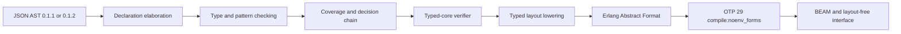

# Data and Pattern Overview

## Status and authority

This chapter and its eight sibling chapters are the normative Catena 0.1.2 data
and pattern slice. Together they complete checklist item C002. Their executable
evidence is published as Catena compiler commit `ae311604ef587a022ce2b7b46599200fcb96a7ab`.
They extend rather than replace the
[0.1.1 type-system specification](../type-system/README.md).

`MUST`, `MUST NOT`, `SHOULD`, and `MAY` express conformance requirements. An
*invalid* program MUST be rejected before BEAM generation. Examples and
rationale are non-normative unless a conformance section says otherwise.

Document status, content labels, rule references, and conflict handling follow
the repository
[Specification Authority](../../SPECIFICATION-AUTHORITY.md).

## Guarantees

Version 0.1.2 provides:

- fresh nominal, closed algebraic datatypes with kinded parameters;
- atomic mutually recursive declaration groups;
- nullary, positional-product, and named-product constructors;
- transparent constructor interfaces or fully abstract type interfaces;
- principal rank-1 constructor use for ordinary datatypes;
- annotation-directed GADT patterns and rigid existential patterns;
- pure wildcard, binder, literal, tuple, constructor, `as`, and `or` patterns;
- single-evaluation, top-to-bottom matching with typed Boolean guards;
- compile-time exhaustiveness and redundancy errors with missing witnesses;
- explicit, compiler-generated constructor-complete folds;
- deterministic layout-free module interfaces; and
- verified uniform and compact BEAM representations with the same source
  semantics.

Ordinary ADTs remain in the C001 principal profile. A constructor with an
explicit refined result or existential binders moves matching into the
annotation-directed profile described by
[GADT and Existential Patterns](gadt-and-existential-patterns.md).

## Deliberate exclusions

Version 0.1.2 does not add:

- structural row variants or row records;
- list, record, map, binary, range, view, active, or pattern-synonym patterns;
- an implicit partial-match operation or hidden `Match` exception;
- separate construction and matching permissions;
- an open-datatype or `non_exhaustive` evolution marker;
- stable native, foreign, or wire representation attributes;
- automatic mapping, traversal, categorical instances, or recursive
  catamorphisms; or
- validation that converts an untrusted Erlang term into a typed Catena ADT.

Those exclusions are semantic boundaries, not reserved implementation hooks.
Later versions MUST introduce them through explicit contracts rather than
reinterpret 0.1.2 programs.

## Compiler boundary

The executable bootstrap accepts JSON AST 0.1.1 and 0.1.2. Input 0.1.1 is normalized
into the 0.1.2 internal form and contains no datatype declarations. JSON is a
temporary toolchain interface, not Catena's source syntax.

The required compilation path is:

> **Non-normative diagram.**

The verifier MUST reject malformed constructor, binding, equality, coverage,
derivation, or layout evidence independently of the inference path.

## Connections (non-normative)

The design rationale and evidence trail remain in
[Algebraic Data Types](../../20-notes/algebraic-data-types.md) and its
[topic map](../../10-maps/algebraic-data-types.md). Exact test evidence is
recorded in the [C002 journal entry](../../50-journal/2026-08-02-c002-executable-data-and-pattern-conformance.md).
