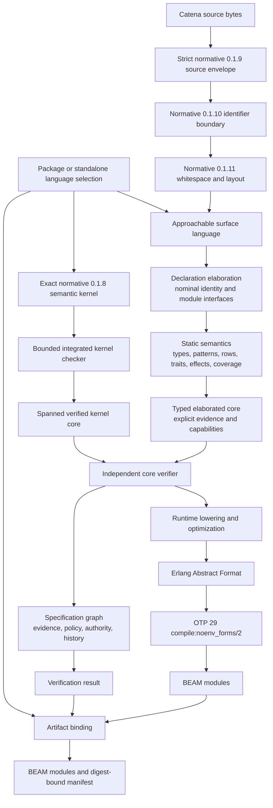

# Catena Language Overview

Catena is a category theory-inspired functional programming language for the
BEAM VM. Its central design goal is to make reliable composition, explicit
effects, and mathematically grounded abstractions useful to ordinary
programmers without requiring them to learn the formal vocabulary first.

The mathematics belongs in the language's semantics, laws, derivations, and
compiler guarantees. The everyday surface should instead describe recognizable
programming behaviors: mapping values, combining results, sequencing work,
handling requests, checking promises, and composing flows.

This document consolidates the current research into one architectural view.
It is a developing design overview rather than a finished language
specification. Detailed arguments, evidence, and unresolved questions remain in
the linked notes, maps, and inquiries.

## Architecture at a glance

The architecture separates three concerns that are often conflated:

1. The **surface language** is optimized for comprehension and useful
   diagnostics.
2. The **typed core** makes every abstraction explicit enough for checking,
   elaboration, and compilation.
3. The **artifact model** separates executable runtime obligations from
   verification evidence that can be erased from BEAM code.

## Design principles

### Familiar behavior first

Catena should teach programmers what an abstraction does before exposing its
mathematical name. Documentation and diagnostics may connect an approachable
public term to a formal concept, but formal terminology should not be required
to write ordinary programs. The current vocabulary research is developed in
[An Approachable Vocabulary for Catena](20-notes/approachable-language-vocabulary.md).

### Inference for ordinary code, annotations at complexity boundaries

Ordinary rank-1 code receives the named **principal core** guarantee: complete
Hindley–Milner inference and principal types. Explicit predicative higher rank,
GADT refinements, and rigid existentials use the named **annotation-directed
advanced** profile. The advanced checker promises local sound and decidable
checking, not global inference completeness or principal types. The normative
boundary is the
[Catena 0.1.1 Type-System Specification](60-specification/type-system/README.md).

### Mathematical laws are meaningful, but not magical

Traits can state laws and derived operations can depend on them. Merely naming
an implementation does not prove that it obeys those laws, however. Compiler
optimizations should trust laws only when the implementation is built in,
derived by a trusted rule, or accompanied by evidence the compiler can check.
Operational concerns such as evaluation order, effects, strictness, and cost
remain separate contracts.

### Effects remain visible

A function's type should distinguish its returned value from the requests it
may make. Handlers interpret those requests. Capabilities should be lexical and
statically elaborated, avoiding runtime searches for an appropriate handler.

### Failure and variation are explicit

Catena has no undefined behavior. Invalid input fails without publishing
successful output, implementation limits retain distinct diagnostics, and
runtime failures or traps are specified outcomes. Any implementation-defined
choice must be enumerated and published; unprofiled variation is limited to
bounded presentation or internal strategy that cannot change semantics,
stable diagnostic identity, governance, or artifact identity. The
repository-level [Catena Conformance Vocabulary](CONFORMANCE-VOCABULARY.md)
governs these interpretations across all normative language revisions.

### Language changes are selected, not ambient

A package should name one edition, exact language revision, and preview set.
A compiler update must not silently move that package to newer semantics.
Dependencies may retain different selections and interoperate through checked
semantic interfaces; runtime functions do not dispatch on an edition service.
The candidate model is developed in
[Language Editions and Feature Lifecycle](20-notes/language-editions-and-feature-lifecycle.md).

### Governance is opt-in at the project boundary and strict inside its scope

A project does not have to adopt Catena's language-integrated specification and
governance system. Once a declaration or project area is governed, its claims,
evidence requirements, authorization policy, and state transitions are
compiler-visible obligations rather than advisory comments.

### Verification material should not become accidental runtime weight

Proofs, specifications, evidence, and governance history may be checked during
compilation and omitted from generated `.beam` modules when they create no
runtime obligation. Erasure must be justified; tests, approvals, or bounded
checks do not automatically prove that a runtime monitor is unnecessary.

## The language layers

### 1. Surface and usability

The outer layer contains modules, names, expressions, declarations,
annotations, diagnostics, and documentation vocabulary. It should be
expression-oriented, immutable by default, and explicit where program behavior
would otherwise be surprising.

The surface language is responsible for:

- approachable names for common abstractions;
- readable algebraic data declarations and exhaustive pattern matching;
- eager list comprehensions whose iteration, filtering, effects, and mismatch
  behavior are visible in the language contract;
- concise type and effect annotations;
- syntax for declaring and handling effects;
- syntax for traits, implementations, laws, and derived operations;
- specification and governance declarations where a project opts into them;
- diagnostics that explain both the immediate problem and the relevant
  abstraction.

Exact syntax and many public names are still open design questions. The
semantic distinctions below are more settled than their spelling.

### 2. Functional core and type inference

The foundational static type system is a strict, expression-oriented,
rank-1 Hindley–Milner core. Its important initial properties are:

- complete inference and principal types for the ordinary rank-1 fragment;
- let-polymorphism with a generalization discipline compatible with effects;
- structural records and variants described by kinded rows and lacks
  constraints;
- no implicit nominal subtyping;
- coherent traits elaborated into explicit evidence or dictionaries;
- explicit universal quantification and bidirectional checking for
  higher-rank boundaries;
- stable public module signatures as compilation and compatibility contracts.

Pure function types can use the familiar form `A -> B`. An effectful
function needs a distinct form such as `A ->{e} B`, where `e`
describes the permitted requests. Value rows and effect rows are related
techniques but different theories; the compiler should not treat them as one
undifferentiated row mechanism.

The initial language deliberately avoids overlapping or local trait
implementations, inferred polymorphic recursion, impredicativity, unrestricted
type-level functions, implicit subtyping, and first-class resumptions. These
exclusions protect predictability and leave room for later, evidence-driven
extensions.
See [A Greenfield Type System for Catena](20-notes/catena-greenfield-type-system.md)
and [Hindley–Milner Type Inference](20-notes/hindley-milner-type-inference.md).

### 3. Algebraic data and patterns

Closed nominal algebraic data types are part of the ordinary inferred
language. Ordinary constructors have uniform result types, keeping them within
the Hindley–Milner fragment. Atomic recursive groups may contain any
well-kinded payload; positivity and regularity constrain derivation, not basic
declaration validity. Structural row variants remain a separate tool for open
data.

Pattern matching is ordered, pure at the pattern boundary, and checked for
exhaustiveness and redundancy. Diagnostics should provide useful witnesses for
missing cases. A module may hide constructors to preserve an abstract
representation, and the runtime layout of a type is not part of its public
contract unless a separate stable-layout mechanism says so.

Version 0.1.2 fixes wildcard, binder, integer and Boolean literal, tuple,
constructor, `as`, `or`, and nested patterns. It checks exhaustiveness and
redundancy through one usefulness analysis, accounts for empty and abstract
types, and treats guards conservatively. Transparent interfaces expose the
whole constructor family; abstract interfaces expose only nominal identity and
kind.

The only initial compiler derivation is an explicit constructor-complete
`Type.fold`; it performs no implicit recursive traversal. Generalized
algebraic datatypes and constructor existentials use the explicitly annotated
advanced profile with branch-local equalities and non-escape checks. Uniform
and compact BEAM layouts implement one layout-free source meaning and module
interface. Programmable views, pattern synonyms, categorical instances, and
stable external layouts remain separate design spaces. See the normative
[Data and Pattern Specification](60-specification/data-and-patterns/README.md)
and its rationale in [Algebraic Data Types](20-notes/algebraic-data-types.md).

Normative version 0.1.3 defines the condition between a successful structural
pattern and commitment to its body. It selects a closed total `Bool`/`Int`
fragment, acyclic signed predicates, one-time ordered evaluation, conservative
difference-constraint coverage, canonical interface evidence, and equivalent
native or ordinary BEAM lowering. Ordinary matches and multi-clause functions
must be exhaustive; a native-only typed receive harness may suspend, but does
not yet define public receive syntax, timeouts, or process effects. See the
[Clause Condition Specification](60-specification/clause-conditions/README.md)
and its rationale in [Clause Guards](20-notes/clause-guards.md).

### 4. Traits and categorical structure

Category-inspired abstractions are ordinary traits rather than privileged
syntax. Normative 0.1.4 fixes seventeen behavior-first public capabilities:

- value structure: `Equatable`, `Orderable`, `Combiner`, and
  `EmptyCombiner`;
- unary structure: `Reducible`, `Mapper`, `MultiMapper`,
  `ValueEmbedder`, `CollectingMapper`, `Chainable`, `Workflow`,
  `ContextualMapper`, and `FocusReader`;
- binary structure: `TwoSlotMapper`; and
- composition structure: `Composable`, `IdentityComposer`, and
  `TransformRouter`.

Their relationships matter more than a flat list. For example, ordering builds
on equality; a monoid adds an identity to a semigroup; applicative structure
builds on mapping and application; and traversing combines mapping with
reduction-like structure.

These names and their method ABI are singular: formal names such as Functor,
Monad, or Arrow appear in reference metadata, not as competing source aliases.
Compile-time evidence is specialized into direct calls and erased before BEAM
execution. See the
[Trait and Categorical Operation Specification](60-specification/traits-and-categorical-operations/README.md)
and its rationale in
[Category Theory for Programming](20-notes/category-theory-for-programming.md).

### 5. Combinators and derived libraries

Most reusable composition belongs in libraries and derivation rather than
syntax. The research proposes five tiers:

1. universal function and data-routing combinators;
2. minimal trait operations plus derived operations;
3. modules derived for particular algebraic data types;
4. focused advanced packages such as optics or recursion schemes;
5. compiler-internal combinators used to implement elaboration and analysis.

Each combinator needs two kinds of contract. Its extensional contract describes
the values it computes and the laws it obeys. Its operational contract
describes evaluation order, strictness, effects, allocation, stack behavior,
and short-circuiting.

Pure mapping remains pure. Effectful traversal should be expressed through a
traversal abstraction, an effect row, or a domain-specific operation rather
than silently changing the meaning of `map`. See
[Combinators for Algebraic Data and Categorical Programming](20-notes/combinators-for-algebraic-data-and-categorical-programming.md).

List comprehensions are a dedicated list control form above this library
vocabulary. Their typed qualifier tree preserves left-to-right, depth-first
evaluation, distinguishes total from filtering patterns, and can lower to
fused tail-recursive workers without making open class dispatch part of their
meaning. See [List Comprehensions](20-notes/list-comprehensions.md).

### 6. Algebraic effects and capabilities

An effect declaration introduces nominal request operations. A function's
effect row records which families of requests it may perform, while a handler
provides an interpretation. Normative 0.1.5 fixes the bounded initial design:

- first-order effect operations;
- open effect rows with a defined policy for repeated labels;
- lexical, statically elaborated capabilities;
- deep handlers;
- affine resumptions that may be abandoned or resumed once;
- clause-scoped, non-escaping resumption values;
- open forwarding for requests a handler does not interpret.

Request sites use `request`; signatures use `uses`; and module-level named
handlers apply through `handle ... using ...`. An unqualified request requires
one compatible lexical capability, while ambiguity requires an explicit name.

Multi-shot resumptions, shallow handlers, higher-order scoped effects, and
first-class resumption storage are intentionally outside the initial core.
Cleanup, cancellation, task lifetime, and other structured-runtime obligations
need a scope mechanism rather than being modeled solely as ordinary resumable
operations.

The implementation path begins with a small typed handler calculus and a
reference interpreter, then elaborates capabilities and uses a simple
continuation-passing backend. Measurement should determine where selective CPS
or native stack-segment support is worthwhile. See
[Algebraic Effects and Handlers](20-notes/algebraic-effects-and-handlers.md)
and the normative
[Effect and Handler Specification](60-specification/effects-and-handlers/README.md).

### 7. Specifications and governance

Catena's assurance layer treats specifications as typed language artifacts.
Its conceptual model contains:

- a typed graph of claims and their dependencies;
- evidence records distinct from the claims they support;
- authorization policy distinct from truth or proof;
- append-only governance transitions and decision history;
- explicit governed scopes and fail-closed checks for governed actions.

Useful claim forms include needs, promises, invariants, properties, examples,
models, refinement and conformance relationships, attestations, and decisions.
Each form requires a precise meaning; these are not interchangeable ways to
write comments.

Specification expressions should run in a pure, total, and deterministic
checking context. External observations arrive as attributable evidence rather
than hidden compiler effects. A governed package may reject release or another
protected transition when required evidence or authority is missing, while
local drafts may still compile if the declared policy permits them. Governance
does not automatically spread through every dependency.

See
[Language-Integrated Specifications and Governance](20-notes/language-integrated-specifications-and-governance.md)
for the rationale and the
[normative 0.1.6 specification](60-specification/specifications-and-governance/README.md)
for the bounded semantic and conformance contract.

### 8. Editions, previews, and compatibility

Normative C008 at 0.1.7 separates four identities: edition, exact language revision,
artifact schema, and compiler-package release. Edition `0.1` is the prototype
compatibility track, while revisions `0.1.1` through `0.1.7` name cumulative
semantic boundaries. A new package records its exact selection; retained pins
do not float when a compiler learns a later revision.

A named preview is complete enough for bounded use but deliberately
impermanent. Preview can become stable or withdrawn; stable can become
deprecated and then removed. Public preview use propagates through module
interfaces, while private use does not force a dependency opt-in. Version
0.1.7 intentionally publishes no actual preview feature.

Interfaces, specialization identities, BEAM compile metadata, assurance
records, approvals, and applicable governance policy bind the selection.
These are compile-time and artifact identities rather than runtime dispatch.
Historical 0.1.6 signed records keep their old domain; 0.1.7 records use one
version-aware domain without downgrade fallback.

The bounded contract is supported by explicitly authorized immutable
implementation evidence. See the
[normative specification](60-specification/editions-and-feature-lifecycle/README.md),
the [resolved inquiry](40-inquiries/how-should-catena-version-editions-and-language-features.md),
and the
[C008 conformance record](50-journal/2026-08-05-c008-edition-conformance.md).

### Normative source-text envelope

Normative C013 defines exact revision 0.1.9 as a source-only frontend. It
accepts strict UTF-8, rejects leading byte-order marks and lone CR, maps LF and
CRLF to one logical newline, preserves every other Unicode scalar without
whole-file normalization, and retains original-byte spans with scalar-based
lines and columns. This boundary establishes decodable positioned text, not
tokens, identifiers, grammar, modules, persisted AST, or executable meaning.

The [source-text map](10-maps/source-text-encoding-and-normalization.md),
[normative specification](60-specification/source-text/README.md), and
[C013 evidence record](50-journal/2026-08-17-c013-source-text-encoding-and-normalization.md)
separate that envelope from later lexical and file-language work. Normative
C014 now fixes standalone identifier and qualified-name validation on top of
the envelope; C015 defines whitespace/layout classification; C016 defines
comments and documentation attachment; C017 defines atomic literal spelling,
decoding, and source provenance; C018 defines numeric literal meaning;
G019–G020 retain the
remaining lexical grammar and file-language work.
Existing JSON revisions and the exact 0.1.8 semantic kernel retain their own
frontend and artifact identities.

### Normative identifier boundary

Normative C014 defines exact revision 0.1.10 as a source-only identifier
frontend. It uses pinned Unicode 17 XID properties, requires NFC source
spelling, preserves case, filters each segment through the Unicode General
Security Profile and Highly Restrictive script level, reserves a closed hard
keyword set with backtick escapes, and defines dot-qualified standalone names.
Confusable skeleton collisions are deterministic warnings that policy may
promote to errors. It does not yet define a whole-file lexer, parser, module
namespace, or import resolution.

The [identifier map](10-maps/identifier-and-name-security.md),
[normative specification](60-specification/identifiers/README.md), and
[C014 evidence record](50-journal/2026-08-17-c014-identifiers-and-name-security.md)
connect those rules to the pinned data generator, public validation boundary,
CLI, and exhaustive normalization evidence.

### Normative whitespace and layout boundary

Normative C015 defines exact revision 0.1.11 as a source-only token-event
layout boundary. Indentation is non-semantic; ASCII space, tab, and C013
logical LF are the only layout whitespace; hard LF and semicolon separate
sibling forms; and lexer-supplied token capabilities plus continued or block
delimiter frames decide line continuation. The lossless result preserves
original-byte spans and does not claim a complete lexer.

The
[whitespace and layout map](10-maps/whitespace-layout-and-line-continuation.md),
[normative specification](60-specification/whitespace-and-layout/README.md),
and [C015 evidence record](50-journal/2026-08-17-c015-whitespace-and-layout.md)
connect those rules to the abstract sibling-compiler layout engine. C017 now
defines literal-contained line ownership; G019 remains responsible for
concrete token capability assignments.

### Normative comments and documentation boundary

Normative C016 defines exact revision 0.1.12 as a source-only abstract comment
boundary. It recognizes line and nested block comments, preserves every
comment-owned logical LF through C015 layout, and attaches normalized outer
documentation only to the next parser-supplied declaration target. Attached
bodies use CommonMark 0.31.2, raw HTML cannot execute unsanitized, and only the
exact `catena doctest` info string opts into a future runner.

The [comments map](10-maps/comments-and-documentation-comments.md),
[normative specification](60-specification/comments-and-documentation-comments/README.md),
and [C016 evidence record](50-journal/2026-08-18-c016-comments-and-documentation-comments.md)
connect those rules to the sibling compiler's abstract scanner and resolver.
G019 and P109 still own complete token/declaration grammar, G020 owns
file/module attachment, and G119 owns actual doctest execution.

### Normative literal boundary

Normative C017 defines exact revision 0.1.13 as a source-only atomic literal
boundary. It recognizes exact Boolean keywords; unsigned binary, octal,
decimal, and hexadecimal integers; decimal floats; cooked and exact-hash raw
text; one-scalar characters; and cooked/raw bytes. It decodes a closed escape
set without text normalization, keeps every raw LF inside the token, and
retains the logical lexeme, original units/spans, decoded payload, and ordered
verbatim/escape provenance pieces.

The [literal map](10-maps/literal-grammar.md),
[normative specification](60-specification/literal-grammar/README.md), and
[C017 evidence record](50-journal/2026-08-18-c017-literal-grammar.md) connect
those rules to the sibling compiler's atomic scanner and active `LIM002` and
`LIM004` boundaries. Runtime numeric types and rounding are fixed by the
normative [0.1.14 numeric specification](60-specification/numeric-literal-semantics/README.md)
and its [map](10-maps/numeric-literal-semantics.md); G019/P109
own complete token/grammar composition; and compound/BEAM-native data remains
under G040/G042/P093/G097. Existing cooked and raw text is static; a future
interpolation feature needs a new prefix.

### Normative formal semantic kernel

Normative C010 defines exact revision 0.1.8 through a separate executable
semantic-kernel input. It does not replace the future approachable frontend or
re-encode every feature of the retained JSON revisions. Instead, its closed
S-expression grammar composes a deliberately bounded subset in one model:
annotated rank-1 functions and local schemes, regular positional data,
structural record and variant terms, head-bounded matching, one-parameter
closed traits, named deep handlers with affine resume, explicit traps, and
typed local actors.

The kernel gives C010 an end-to-end audit route: spanned input, integrated
type/effect checking, independently rederived core evidence, a CEK-style local
machine, nondeterministic actor configurations, bounded schedule exploration,
fixed BEAM values, public process interfaces, and OTP 29 lowering. `Process M`
guarantees only a closed sendable message type; it does not promise a protocol,
fairness, deadlock freedom, links, supervision, distribution, or time.

The seven [Formal Semantic Kernel chapters](60-specification/formal-semantic-kernel/README.md)
have normative authority through the explicitly authorized immutable compiler
identity and post-commit evidence recorded in the
[C010 journal](50-journal/2026-08-06-c010-formal-semantic-kernel.md). Earlier
0.1.1 through 0.1.7 inputs and their normative behavior remain unchanged.

### 9. Verification erasure and artifact integrity

After checking, the compiler divides specification material into two
categories:

- **verification-only material**, which may be erased; and
- **runtime material**, such as monitors, admission checks, or values the
  executable program actually needs.

A declaration can be well formed without being established. A claim can also
be assumed under an explicit policy without being proved. The compiler and
manifest must preserve these distinctions rather than presenting all accepted
builds as equally verified.

The normative 0.1.6 release artifact is:

- ordinary `.beam` modules containing only the runtime program; and
- a signed, content-addressed sidecar manifest containing claims, evidence,
  assumptions, policy decisions, transition records, and the exact digest of
  the BEAM artifacts it describes.

The full specification graph should not be placed in BEAM metadata by default.
Version 0.1.6 does not define a monitor-retaining profile; that later feature
requires a separate runtime and cost contract.

Safe erasure requires preservation of types, effects, observable semantics, and
artifact binding. It also requires checking the transitive closure of runtime
dependencies: a proof term cannot be erased if executable code consumes it.
Provisional modes such as `static`, `monitor`, `assume`,
and `test` may make the intended assurance boundary visible, but their
exact surface design remains open.

## Compiler architecture

The compiler should be organized around explicit intermediate representations
and independently testable analyses.

### Front end

- edition, exact revision, and preview selection resolver;
- immutable feature-state and compatibility-change registry;
- lexer, parser, and concrete syntax tree;
- name and module resolver;
- kind checker;
- desugaring from approachable surface forms into a smaller semantic language.

### Static semantics

- Hindley–Milner unifier and generalizer;
- record and variant row solver;
- effect-row solver;
- coherent trait solver;
- bidirectional checker for explicit higher-rank types;
- match coverage and redundancy checker;
- implemented normative guard-safety, acyclic predicate, and deterministic
  guarded-coverage checker for the 0.1.3 `Bool`/`Int` fragment;
- variance, positivity, and derivation analysis;
- public-signature and compatibility checker.

### Elaboration

- trait evidence and dictionary elaborator;
- lexical capability elaborator;
- handler translation;
- typed list-comprehension qualifier-tree elaborator and fused worker
  generator;
- derived-operation generator;
- ordered guard-tree and shared-continuation lowering with selectable native
  or ordinary condition paths;
- typed core verifier.

Elaboration is the architectural hinge: friendly source notation becomes a
small typed core in which dependencies that were implicit at the surface are
explicit and auditable.

### Assurance

- specification graph builder and type checker;
- property, model, and proof-obligation generator;
- small proof-certificate checker;
- authorization and policy evaluator;
- append-only transition validator;
- evidence store and manifest generator;
- canonical serializer, digest binder, and signature verifier;
- erasure analysis.

Large or replaceable solvers, test generators, model checkers, and CI
orchestrators can remain outside the trusted core when their output is
rechecked. The trusted base should be small enough to audit and must include
the normative semantics, static checkers, canonical serialization, digest
binding, policy interpretation, transition validation, and signature checks.

### Backend

- typed-core optimizer;
- effect and handler lowering;
- selective continuation transformation where needed;
- BEAM representation and calling-convention selection;
- Erlang Abstract Format adapter with original-source annotations;
- OTP 29 `compile:noenv_forms/2` integration;
- module and debug metadata plus artifact-manifest binding.

Catena is BEAM-only. The bootstrap compiler is written in Elixir and is
intended to self-host at the separately gated late-0.x G141 milestone, after
the language can express the compiler and reproduce its outputs. It MUST
delegate `.beam` construction to OTP's
supported Erlang source or Abstract Format path; direct Core Erlang, BEAM
assembly, and a custom `.beam` writer are not architectural alternatives. The
exact boundary is specified in
[Typed-Core Elaboration](60-specification/type-system/typed-core-elaboration.md).

The resulting pipeline is:

```mermaid
flowchart LR
    S[Resolve edition, revision, and previews] --> P[Parse]
    P --> N[Resolve names and kinds]
    N --> I[Infer or check types, rows, traits, effects]
    I --> M[Check matches and derivations]
    M --> E[Elaborate explicit typed core]
    E --> V[Verify typed core]
    V --> A[Check assurance graph]
    A --> X[Erase verification-only material]
    X --> L[Lower effects and optimize]
    L --> F[Erlang Abstract Format]
    F --> O[OTP 29 compiler]
    O --> B[BEAM modules]
    A --> S[Signed bound manifest]
```

## The BEAM runtime boundary

Catena should use the BEAM where its semantics align with the runtime and add
abstraction only where the language requires stronger guarantees.

- Pure code should compile to ordinary direct calls and data operations.
- Effect handlers should impose overhead primarily on effectful paths.
- Erased specifications should impose no runtime execution cost.
- Runtime monitors and admission hooks remain when policy or semantics require
  them.
- Process identity is not sufficient as organizational or governance identity.
- Governance history must survive compilation and deployment as durable,
  authenticated evidence.
- Hot upgrades need explicit compatibility rules and evidence rather than an
  assumption that a successfully loaded module is semantically safe.

The exact process, supervision, structured-concurrency, foreign-function, and
hot-upgrade models remain important open layers. BEAM fault tolerance is a
runtime foundation, not a substitute for specifying how Catena programs expose
and control concurrency.

## Artifact model

The proposed toolchain produces several conceptually distinct artifacts:

| Artifact | Purpose |
| --- | --- |
| Source modules | Human-authored program, type, effect, trait, and specification declarations |
| Typed core | Explicit semantic record used by the compiler and checkers |
| Verification records | Claims, evidence, assumptions, proofs, policy decisions, and transitions |
| Runtime IR | Only executable values, operations, capabilities, handlers, and required checks |
| BEAM modules | Deployable code and selected runtime/debug metadata |
| Signed manifest | Content-addressed assurance record bound to the exact executable artifacts |
| Language registry | Retained editions, exact revisions, feature histories, compatibility changes, and migration edits |

This separation lets a release remain small without severing the evidence that
explains why it was accepted.

## Current commitments

The research currently converges on these decisions:

- a strict functional core with rank-1 principal inference;
- a separate annotation-directed profile for explicit predicative higher rank,
  signature-directed GADTs, and rigid constructor existentials;
- closed nominal algebraic data types plus distinct structural row types;
- exhaustive, pure pattern matching;
- coherent traits with explicit elaboration;
- multi-parameter traits with terminating functional dependencies and
  associated types, but no overlap, local instances, or associated constants;
- category-inspired abstractions expressed through ordinary traits and
  libraries;
- nominal algebraic effects with static effect rows and lexical capabilities;
- deep affine handlers as the initial resumption discipline;
- package-local edition and exact-revision selection with named previews and
  retained historical pins under normative C008;
- a strict UTF-8 source-text envelope with LF/CRLF logical newlines,
  normalization preservation, and original-byte scalar locations under
  normative C013;
- Unicode 17 XID identifiers, NFC source spelling, standalone qualification,
  hard keywords, and name-security checks under normative C014;
- non-semantic indentation, narrow layout whitespace, newline/semicolon
  separators, and token-directed line continuation under normative C015;
- one conformance vocabulary across every normative chapter, with no undefined
  behavior and explicit invalidity, variability, limit, and trap classes under
  governance milestone C009;
- opt-in language-integrated specifications that become enforced within their
  declared scope;
- explicit separation of claims, evidence, authority, and historical
  transitions;
- erasure of verification-only material with a signed sidecar manifest bound
  to generated BEAM code.

These are architecture-level commitments. Syntax, naming, proof rules, and
runtime representation still require validation.

## Open design boundaries

The main unresolved areas are:

- literals, concrete tokenization, exact surface grammar, and behavior-first
  vocabulary beyond C017's abstract literal boundary;
- integration of the normative type-system, data, and clause-condition slices
  with complete handler and source-language calculi;
- the evidence model for trait laws and optimizer rewrites;
- production integration and performance evidence for effect-row duplicates,
  lexical handler selection, and handler lowering;
- processes, supervision, structured concurrency, cancellation, and resource
  scopes;
- modules, packages, foreign calls, stable layouts, and hot upgrades;
- ecosystem-scale compatibility across future editions and eventual compiler
  self-hosting under G141;
- governance identity, revocation, transparency logs, and long-lived evidence;
- the proof kernel and interchange format for externally produced
  certificates;
- usability studies and performance measurements;
- later features such as impredicativity, multi-shot handlers, programmable
  views, pattern synonyms, generic or streaming comprehensions, optics syntax,
  and recursion schemes.

An open boundary should not be mistaken for an invitation to choose features
independently. Each proposal must be checked against principal inference,
effect visibility, operational cost, BEAM behavior, diagnostics, and the goal
of keeping the language approachable.

## Research routes

The [home map](10-maps/home.md) remains the entry point to the complete archive.
The following maps provide the evidence trails behind this overview:

- [Approachable Catena Language Design](10-maps/approachable-catena-language-design.md)
  connects vocabulary, diagnostics, and progressive disclosure.
- [Catena Type-System Design](10-maps/catena-type-system-design.md) connects
  inference, rows, traits, effects, and higher-rank boundaries.
- [Algebraic Data Types](10-maps/algebraic-data-types.md) connects data
  declarations, pattern semantics, representation, and staged extensions.
- [Category Theory for Programming](10-maps/category-theory-for-programming.md)
  connects the initial trait hierarchy and its laws.
- [Combinators for Algebraic Data and Categorical Programming](10-maps/combinators-for-algebraic-data-and-categorical-programming.md)
  connects the proposed reusable operation tiers.
- [List Comprehensions](10-maps/list-comprehensions.md) connects surface
  iteration, pattern coverage, effects, algebraic explanation, and BEAM
  lowering.
- [Algebraic Effects and Handlers](10-maps/algebraic-effects-and-handlers.md)
  connects effect semantics, typing, capability elaboration, and BEAM lowering.
- [Language-Integrated Specifications and Governance](10-maps/language-integrated-specifications-and-governance.md)
  connects specifications, evidence, policy, history, and erasure.
- [Language Editions and Feature Lifecycle](10-maps/language-editions-and-feature-lifecycle.md)
  connects package selection, exact revisions, previews, compatibility,
  migration, artifacts, signatures, and compiler bootstrap boundaries.
- [Catena Conformance Vocabulary](10-maps/catena-conformance-vocabulary.md)
  connects requirement force, behavior classes, standards evidence,
  variability registers, validation, and the compiler profile.
